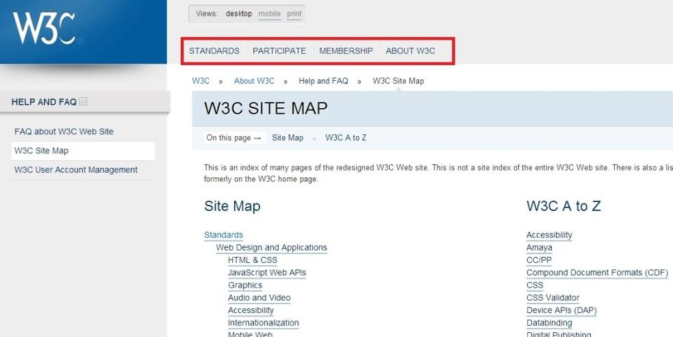
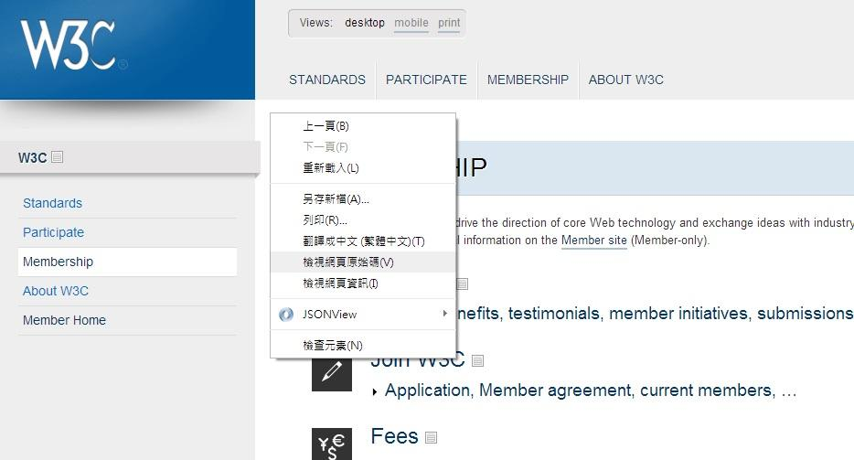
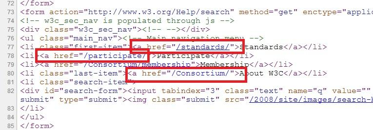

# GN1240102E 在頁面頂端加入鏈結，連到該頁面的內容區域的開頭位置

- **稽核評量碼**：GN1240102E
- **對應成功準則**：2.4.1
- **對應認證等級**：A
- **對應國際技術碼**：G124
- **類別**：General
- **訊息**：在頁面頂端加入鏈結，連到該頁面的內容區域的開頭位置
- **英文訊息**：G124: Adding links at the top of the page to each area of the content

## 規則說明

任何在HTML或XHTML的網頁內存在鏈結，都需要遵守此指引。

## 檢測說明

1. 先確認網頁的網站頂端確定有導覽欄，並且顯示目前所在頁面。
2. 使用Google Chrome「檢視原始碼」顯示連結 (按下右鍵→檢視原始碼)。
3. 檢查原始碼確認Navigation鏈結到其他頁面。

## 說明

無

## 範例

**圖片說明：** W3C 網站的「W3C SITE MAP」頁面截圖，頁面頂端以紅框標示主要導覽列，包含「STANDARDS」、「PARTICIPATE」、「MEMBERSHIP」、「ABOUT W3C」四個鏈結，每個鏈結對應頁面內的各主要內容區域。左側側欄顯示「HELP AND FAQ」次導覽，目前所在頁面「W3C Site Map」以反白標示。主內容區顯示 Site Map 及 W3C A to Z 兩個區塊。

**圖片說明：** W3C 網站「Membership」頁面，顯示右鍵選單彈出，其中「檢視網頁原始碼」選項以藍色反白標示。頁面頂端導覽列顯示 STANDARDS、PARTICIPATE、MEMBERSHIP（目前所在）、ABOUT W3C 四個鏈結，左側側欄顯示 Standards、Participate、Membership、About W3C、Member Home 等導覽項目。

**圖片說明：** 「檢視網頁原始碼」顯示的 HTML 程式碼，以紅框標示第77至80行的導覽列鏈結程式碼：`<a href="/standards/">Standards</a>`、`<a href="/participate/">Participate</a>`、`<a href="/Consortium/membership">Membership</a>`、`<a href="/Consortium/">About W3C</a>`。示範在頁面頂端的主導覽列中加入鏈結，分別連至各主要內容區域的正確實作方式。
