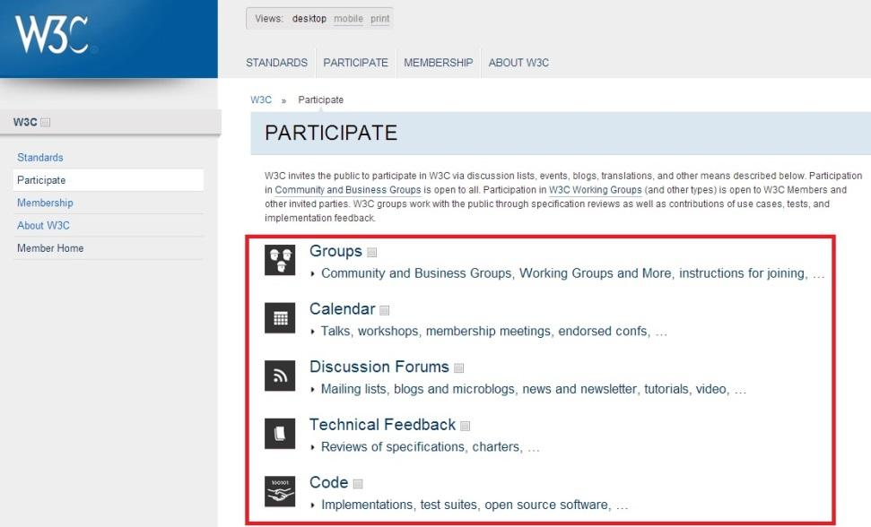
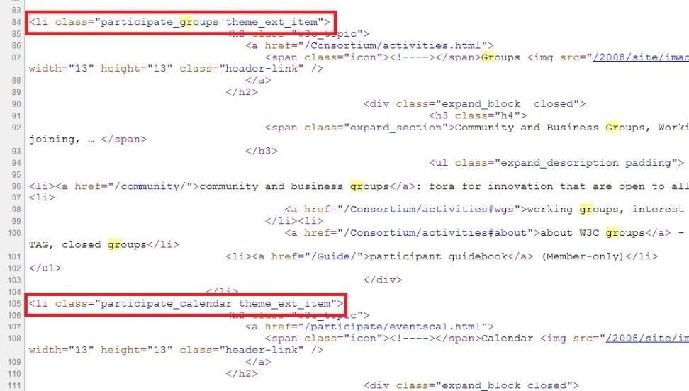

# GN1240103E 使用結構性組件來將鏈結分群

- **稽核評量碼**：GN1240103E
- **對應成功準則**：2.4.1
- **對應認證等級**：A
- **對應國際技術碼**：H97
- **類別**：General
- **訊息**：使用結構性組件來將鏈結分群
- **英文訊息**：SCR28: Using an expandable and collapsible menu to bypass block of content / ARIA11: Using ARIA landmarks to identify regions of a page / H97: Grouping related links using the nav element

## 規則說明

任何在HTML或XHTML的網頁內存在鏈結，都需要遵守此指引。

## 檢測說明

**範例1：檢查每個頁面導覽欄**

1. 檢查每個頁面導覽欄下方是否有分類過後的鏈結。
2. 使用Google Chrome「檢視原始碼」顯示連結(按下右鍵→檢視原始碼)。

**範例2：使用結構單一的地標頁面區域**

原始碼範例：
```html
<div id="header" role="banner">A banner image and introductory title</div>
<div id="sitelookup" role="search">....</div>
<div id="nav" role="navigation">...a list of links here ... </div>
<div id="content" role="main"> ... Ottawa is the capital of Canada ...</div>
<div id="rightsideadvert" role="complementary">....an advertisement here...</div>
<div id="footer" role="contentinfo">(c)The Freedom Company, 123 Freedom Way, Helpville, USA</div>
```

## 說明

無

## 範例



**圖片說明：** W3C 網站「PARTICIPATE」頁面截圖，以紅框標示主內容區的鏈結分群區塊，包含 Groups、Calendar、Discussion Forums、Technical Feedback、Code 五個分類群組，每個群組以圖示、標題及說明文字組成，各自包含相關鏈結。左側側欄顯示 Standards、Participate、Membership、About W3C、Member Home 等導覽鏈結分群。示範使用結構性組件將相關鏈結分群整理，便於使用者瀏覽。



**圖片說明：** 「檢視網頁原始碼」顯示的 HTML 程式碼，以紅框標示第84行 `<li class="participate_groups theme_ext_item">` 與第105行 `<li class="participate_calendar theme_ext_item">` 兩個結構性清單項目。程式碼顯示每個鏈結群組以 `<li>` 元素包裝，內含 `<h2>` 標題（如 Groups、Calendar）及 `<ul>` 鏈結清單，透過語意化 HTML 結構將相關鏈結分群，實現結構性組件分群鏈結的無障礙設計。
