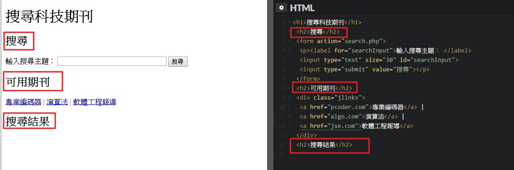
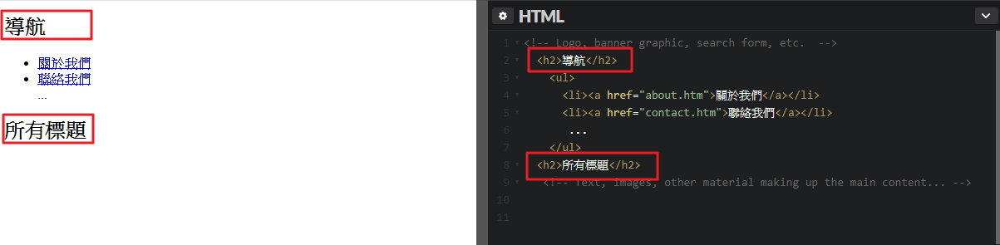

# GN1240104E 在每一個內容區段開頭處提供標題組件

- **稽核評量碼**：GN1240104E
- **對應成功準則**：2.4.1
- **對應認證等級**：A
- **對應國際技術碼**：H69
- **類別**：General
- **訊息**：在每一個內容區段開頭處提供標頭組件
- **英文訊息**：H69: Providing heading elements at the beginning of each section of content

## 規則說明

任何在HTML或XHTML的網頁內存在鏈結，都需要遵守此指引。

## 檢測說明

**範例1：使用標題元素`<h2>`標記每個標題組織搜索頁的各個部分**

```html
<h1>搜尋科技期刊</h1>
<h2>搜尋</h2>
<form action="search.php">
  <p><label for="searchInput">輸入搜尋主題： </label>
  <input type="text" size="30" id="searchInput">
  <input type="submit" value="搜尋"></p>
</form>
<h2>可用期刊</h2>
<div class="jlinks">
  <a href="pcoder.com">專業編碼器</a> |
  <a href="algo.com">演算法</a> |
  <a href="jse.com">軟體工程報導</a>
</div>
<h2>搜尋結果</h2>
```

**範例2：使用標題元素`<h2>`顯示整體組織結構的內容呈現**

```html
<!-- Logo, banner graphic, search form, etc. -->
<h2>導航</h2>
<ul>
  <li><a href="about.htm">關於我們</a></li>
  <li><a href="contact.htm">聯絡我們</a></li>
  ...
</ul>
<h2>所有標題</h2>
<!-- Text, images, other material making up the main content... -->
```

## 說明

無

## 範例



**圖片說明：** 左側為「搜尋科技期刊」範例頁面，以紅框標示三個 `<h2>` 標題元素：「搜尋」（含搜尋表單）、「可用期刊」（含專業編碼器、演算法、軟體工程報導三個鏈結）、「搜尋結果」。右側為對應的 HTML 程式碼，以紅框標示 `<h2>搜尋</h2>`、`<h2>可用期刊</h2>`、`<h2>搜尋結果</h2>` 三個標題標籤，示範在每個內容區段開頭使用標題元素標記結構。



**圖片說明：** 左側為另一範例頁面，以紅框標示「導航」（含關於我們、聯絡我們鏈結）與「所有標題」兩個 `<h2>` 標題。右側為對應 HTML 程式碼，以紅框標示 `<h2>導航</h2>` 與 `<h2>所有標題</h2>` 兩個標題標籤，以及導航鏈結的 `<ul>` 清單。示範使用標題元素呈現整體頁面組織結構，讓輔助技術使用者能快速了解頁面各區段的功能與順序。
