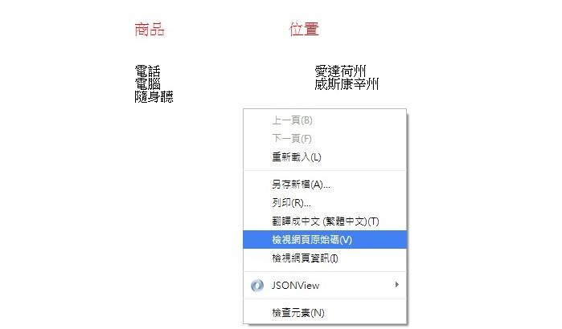
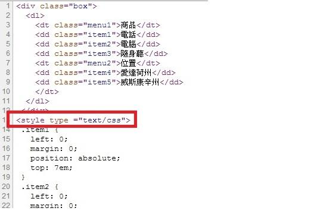

# GN1240105E 根據結構性標記來將內容定位

- **稽核評量碼**：GN1240105E
- **對應成功準則**：2.4.1
- **對應認證等級**：A
- **對應國際技術碼**：C6
- **類別**：General
- **訊息**：根據結構性標記來將內容定位
- **英文訊息**：C6: Positioning content based on structural markup

## 規則說明

任何在HTML或XHTML的網頁內存在鏈結，都需要遵守此指引。

## 檢測說明

1. 確認是否有使用CSS結構性標記，使用chrome瀏覽器開啟網頁，按右鍵點選檢查標籤，即可確認程式碼裡是否使用CSS結構性標記。
2. 使用Google Chrome「檢視原始碼」顯示連結(按下右鍵→檢視原始碼)。

## 說明

無

## 範例

**圖片說明：** 範例頁面顯示一個兩欄佈局表格，左欄標題「商品」下方列出「電話、電腦、隨身聽」，右欄標題「位置」下方列出「愛達荷州、威斯康辛州」。頁面上有右鍵選單彈出，其中「檢視網頁原始碼」選項以藍色反白標示，示範可透過原始碼確認是否使用 CSS 結構性標記進行內容定位。

**圖片說明：** 「檢視網頁原始碼」顯示的 HTML 與 CSS 程式碼。HTML 部分使用 `<dl>` 定義清單結構，以 `<dt>` 標記「商品」、「位置」兩個標題，`<dd>` 標記各項目（電話、電腦、隨身聽、愛達荷州、威斯康辛州），每個元素均指定對應 class（如 menu1、item1~item5）。以紅框標示第13行 `<style type="text/css">` 開始的 CSS 區塊，使用 `position: absolute`、`left`、`top` 等屬性根據結構性標記對各項目進行精確定位，實現視覺佈局與語意結構分離的無障礙設計。
