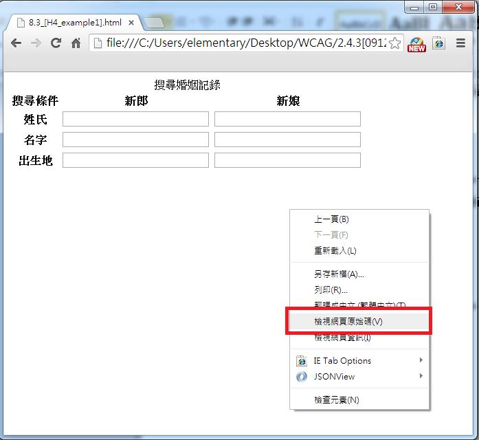
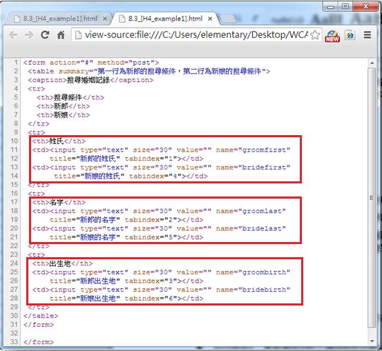
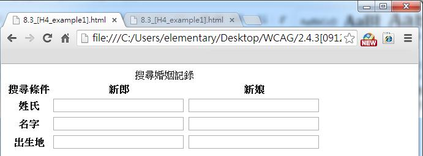

# GN1240300E 按照內容的序列及關連性來安排互動元件的放置順序

- **稽核評量碼**：GN1240300E
- **對應成功準則**：2.4.3
- **對應認證等級**：A
- **對應國際技術碼**：G59
- **類別**：General
- **訊息**：按照內容的序列及關連性來安排互動元件的放置順序
- **英文訊息**：G59: Placing the interactive elements in an order that follows sequences and relationships within the content / SCR26: Inserting dynamic content into the Document Object Model immediately following its trigger element / SCR27: Reordering page sections using the Document Object Model / SCR37: Creating Custom Dialogs in a Device Independent Way

## 規則說明

任何運用HTML或XHTML語法的網頁，都能以此方式來做檢測。

## 檢測說明

1. 在網頁上按右鍵->選擇檢查網頁原始碼。
2. 先確認好每個交互標籤的內容與邏輯順序，以此範例來看，一表格中包含兩個標題，分別為新郎與新娘，其中新郎的搜尋條件要與新娘的搜尋條件對齊。
3. 檢查交互標籤的內容順序是否跟邏輯順序相同。

## 說明

無

## 範例

**圖片說明：** 瀏覽器開啟「搜尋婚姻記錄」表單範例頁面，表格包含「搜尋條件」、「新郎」、「新娘」三欄，搜尋條件列有姓氏、名字、出生地三列，新郎與新娘的輸入欄位對齊排列。頁面上顯示右鍵選單，「檢視網頁原始碼」選項以紅框標示，示範可透過原始碼確認互動元件的排列順序。

**圖片說明：** 「檢視網頁原始碼」顯示的 HTML 程式碼，`<table>` 的 `summary` 屬性說明「第一行為新郎的搜尋條件，第二行為新娘的搜尋條件」。以紅框標示三個表格列（`<tr>`）的程式碼：第一列（姓氏）含新郎姓氏欄位（tabindex="1"）與新娘姓氏欄位（tabindex="4"）；第二列（名字）含 tabindex="2" 與 tabindex="5"；第三列（出生地）含 tabindex="3" 與 tabindex="6"。示範互動元件依內容序列與邏輯關連性排列，Tab 鍵焦點順序先完成新郎欄（1→2→3）再移至新娘欄（4→5→6）。

**圖片說明：** 同一「搜尋婚姻記錄」表單的清楚展示截圖，表格結構整齊，新郎與新娘的姓氏、名字、出生地欄位對齊排列，搜尋條件標籤在左側，各輸入欄位依邏輯順序排列，視覺呈現與 Tab 鍵焦點移動順序一致，符合互動元件按序列及關連性排列的無障礙要求。
