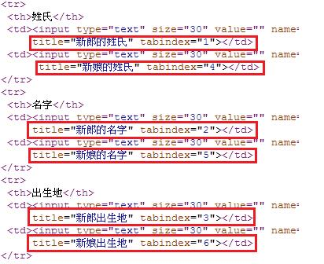
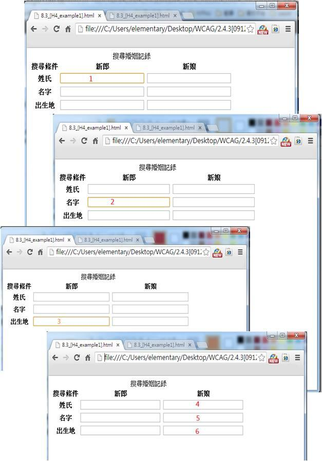

# GN1240301E 在鏈結、表單控制元件、物件間建立合乎邏輯的跳位順序

- **稽核評量碼**：GN1240301E
- **對應成功準則**：2.4.3
- **對應認證等級**：A
- **對應國際技術碼**：H4
- **類別**：General
- **訊息**：在鏈結、表單控制元件、物件間建立合乎邏輯的跳位順序
- **英文訊息**：H4: Creating a logical tab order through links, form controls, and objects

## 規則說明

任何運用HTML或XHTML語法的網頁，都能以此方式來做檢測。

## 檢測說明

1. 檢查是否使用tabindex，在網頁上按右鍵->選擇檢查網頁原始碼。
2. 如果有使用tabindex，檢查tabindex屬性所指定的內容來決定Tab鍵的順序。如下圖所顯示，新郎的姓氏、名字與出生地分別為tabindex=1、tabindex=2、tabindex=3，表示按Tab鍵的順序，輸入完新郎後，再輸入新娘的資料內容。

## 說明

無

## 範例

**圖片說明：** 「搜尋婚姻記錄」表單的 HTML 原始碼截圖，以多個紅框標示各輸入欄位的 `tabindex` 屬性設定：新郎姓氏（tabindex="1"）、新娘姓氏（tabindex="4"）、新郎名字（tabindex="2"）、新娘名字（tabindex="5"）、新郎出生地（tabindex="3"）、新娘出生地（tabindex="6"）。示範透過 tabindex 屬性建立合乎邏輯的 Tab 鍵跳位順序，確保焦點先依序移過新郎的三個欄位後，再移至新娘的三個欄位。

**圖片說明：** 四個連續的瀏覽器截圖，示範按 Tab 鍵在「搜尋婚姻記錄」表單中移動焦點的完整順序：第一個截圖焦點（橘色框，數字「1」）在新郎姓氏欄；第二個截圖焦點（數字「2」）移至新郎名字欄；第三個截圖焦點（數字「3」）移至新郎出生地欄；第四個截圖焦點依序移至新娘的姓氏（4）、名字（5）、出生地（6）欄位。完整示範 tabindex 指定的合乎邏輯跳位順序。
