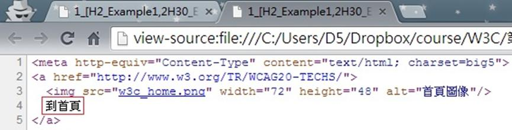

# GN1240401E 針對脈絡中的鏈結，提供描述鏈結目的的鏈結文字

- **稽核評量碼**：GN1240401E
- **對應成功準則**：2.4.4
- **對應認證等級**：A
- **對應國際技術碼**：G91
- **類別**：General
- **訊息**：針對脈絡中的鏈結，提供描述鏈結目的的鏈結文字
- **英文訊息**：G91: Providing link text that describes the purpose of a link / ARIA7: Using aria-labelledby for link purpose

## 規則說明

任何在HTML或XHTML的網頁內存在鏈結，都需要遵守此指引。

## 檢測說明

**範例1：提供描述鏈結目的的文字**

1. 使用Google Chrome「檢視原始碼」顯示連結 (按下右鍵→檢視原始碼)。
2. 檢查是否有提供描述鏈結目的的文字，並點擊連結來驗證。

**範例2：提供鏈結的額外資訊**

```html
<h2 id="headline">Storms hit east coast</h2>
<p>Torrential rain and gale force winds have struck the east coast, causing flooding in many coastal towns.
<a id="p123" href="news.html" aria-labelledby="p123 headline">Read more...</a></p>
```

## 說明

無

## 範例


**圖片說明：** 瀏覽器開啟範例頁面，頁面左上角顯示「到首頁」藍色鏈結文字，清楚描述鏈結的目的（前往首頁）。頁面顯示右鍵選單，「檢視網頁原始碼」選項以藍色反白標示，示範可透過原始碼確認鏈結文字是否清楚描述鏈結目的。



**圖片說明：** 「檢視網頁原始碼」顯示的 HTML 程式碼，第2至5行為鏈結程式碼：`<a href="http://www.w3.org/TR/WCAG20-TECHS/">` 內包含一個 W3C 首頁圖示（``）與「到首頁」文字。圖片設有 alt 屬性「首頁圖像」，且鏈結同時包含描述性文字「到首頁」，示範針對圖文混合鏈結提供清楚描述鏈結目的的文字的正確實作。
