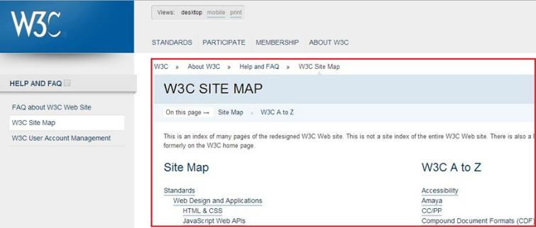
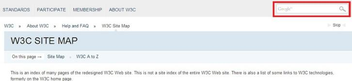
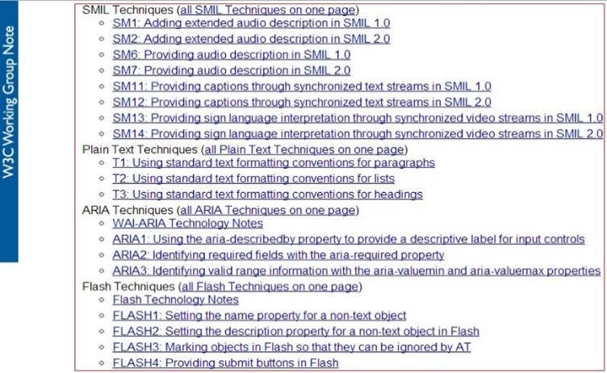
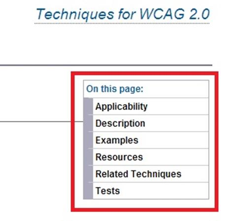

# GN1240500E 提供網站導覽、導覽工具或機制、搜尋功能、網頁清單鏈結等功能，協助使用者尋找內容

- **稽核評量碼**：GN1240500E
- **對應成功準則**：2.4.5
- **對應認證等級**：A
- **對應國際技術碼**：G63
- **類別**：General
- **訊息**：提供網站導覽、導覽工具或機制、搜尋功能、網頁清單鏈結等功能，協助使用者尋找內容
- **英文訊息**：G63: Providing a site map / G64: Providing a Table of Contents / G125: Providing links to navigate to related Web pages / G126: Providing a list of links to all other Web pages / G161: Providing a search function to help users find content / G185: Linking to all of the pages on the site from the home page / H59: Using the link element and navigation tools

## 規則說明

任何在HTML或XHTML的網頁內，需要有協助使用者尋找內容或提供導覽機制的功能。

## 檢測說明

1. 確認網站上有導覽機制(ex:網站地圖)，並確認鏈結目的與文字符合。
2. 確認網站上有搜尋功能，並且確實能搜尋到相關資料。
3. 確認網站上有網頁清單鏈結，並確認鏈結目的與文字符合。
4. 確認網站上有導覽工具，並確認鏈結目的與文字符合。

## 說明

本項檢測碼於110年調整為A等級

## 範例

**圖片說明：** W3C 官方網站的「W3C SITE MAP」頁面截圖，以紅框標示主要內容區域。頁面顯示麵包屑導覽列（W3C > About W3C > Help and FAQ > W3C Site Map）、頁面內快速跳轉鏈結（Site Map、W3C A to Z），以及網站地圖內容（含 Standards 下的 Web Design and Applications、HTML & CSS、JavaScript Web APIs 等鏈結）。左側導覽列有 FAQ about W3C Web Site、W3C Site Map、W3C User Account Management 等鏈結。示範網站提供網站地圖協助使用者尋找內容。

**圖片說明：** W3C 網站「W3C SITE MAP」頁面截圖，右上角以紅框標示搜尋功能欄位（Google 搜尋框），並顯示「Skip」跳過鏈結。頁面標題「W3C SITE MAP」下方有「On this page」快速導覽鏈結（Site Map、W3C A to Z），以及網站說明文字。示範網站提供搜尋功能協助使用者尋找所需內容。

**圖片說明：** WCAG 2.0 技術文件網站地圖頁面截圖，以紅框標示網頁清單鏈結區域，內容包含 SMIL Techniques（SM1–SM14 等鏈結）、Plain Text Techniques（T1–T3）、ARIA Techniques（WAI-ARIA Technology Notes、ARIA1–ARIA3）、Flash Techniques（Flash Technology Notes、FLASH1–FLASH4）等分類鏈結清單。頁面左側有藍色「W3C Working Group Note」垂直標示。示範網站提供完整的網頁清單鏈結協助使用者瀏覽所有相關頁面。

**圖片說明：** WCAG 2.0 技術文件頁面截圖，以紅框標示「On this page」目錄導覽工具，列出頁內各節鏈結：Applicability、Description、Examples、Resources、Related Techniques、Tests。頁面標題為「Techniques for WCAG 2.0」。示範在網頁內提供目錄（Table of Contents）導覽工具，協助使用者快速跳轉至所需章節。
