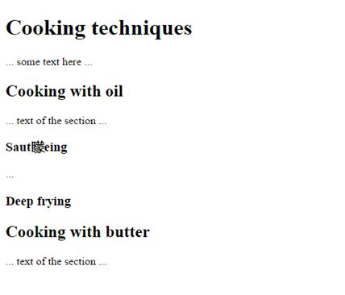

# GN1250101E 為控制滑塊提供單點啟動

- **稽核評量碼**：GN1250101E
- **對應成功準則**：2.5.1
- **對應認證等級**：A
- **對應國際技術碼**：G216
- **類別**：General
- **訊息**：為控制滑塊提供單點啟動
- **英文訊息**：G216: Providing single point activation for a control slider

## 規則說明
本技術的目的是確保在執行基於路徑的手勢時遇到困難的使用者可以操作控制滑塊。控制滑塊是一個具有"拇指移動"的軌道，可以沿著該軌道移動以設置數值。

允許使用者在某個範圍內設置一個值，例如設置音量、更改顏色的色相值、在貸款計算器中放入所需的金額或選擇要捐贈給慈善機構的款項。需要基於路徑的手勢的滑塊將使用向左或向右滑動來更改值，或在特定方向上拖動滑塊的拇指來更改值。

無需基於路徑的手勢即可進行啟動的簡單備用方法是使控制滑塊的軌道可點擊，可透過單擊或單擊軌道來指定值。

提供控制元件(例如，箭頭按鈕)允許透過點(tap)或點擊(click)來增加或減少該值，可以允許設置更細粒度的值。

注意：在觸控螢幕裝置上，當打開諸如內置螢幕報讀軟體之類的作業系統級輔助技術(AT)時，由作者提供的基於路徑的手勢通常無作用。

## 檢測說明
程序

對於每個回應基於路徑的手勢的控制滑塊：
檢查是否可以通過點擊或使用指標單擊來設置控制滑塊(範圍)的值。

預期結果：檢查#1為是。

## 說明
無

## 範例

**圖片說明：** 範例網頁截圖，顯示「Cooking techniques」為一級標題，下有「Cooking with oil」、「Cooking with butter」等二級標題及「Sautéeing」、「Deep frying」等三級標題，各節均有示意文字。此頁面示範控制滑塊的單點啟動概念：使用者無需執行拖曳等路徑手勢，可直接點擊（tap/click）頁面上的軌道或控制元件來設定數值，適合觸控螢幕及輔助技術使用者操作。
