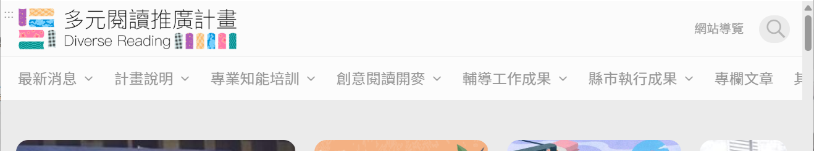
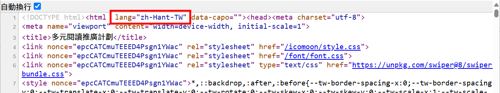

# GN1310100E 明確指出網頁文字所使用的人類語言

- **稽核評量碼**：GN1310100E
- **對應成功準則**：3.1.1
- **對應認證等級**：A
- **對應國際技術碼**：H57
- **類別**：General
- **訊息**：明確指出網頁文字所使用的人類語言
- **英文訊息**：H57: Using language attributes on the html element

## 規則說明
所有的瀏覽器皆有檢視語言的功能，欲知道網頁為何種語言時可用。

## 檢測說明
以Google Chrome瀏覽器為例，在網頁上按右鍵選擇"檢視網頁原始碼"。 搜尋lang=""，即可查看""裡的語言為何，例如：zh-Hant-TW為正體中文、de為德語、fr為法語等。

## 說明
無

## 範例

**圖片說明：** 瀏覽器開啟「多元閱讀推廣計畫（Diverse Reading）」網站首頁截圖，顯示網站頂端標題列、搜尋圖示及導覽列（最新消息、計畫說明、專業知能培訓、創意閱讀開麥、輔導工作成果、縣市執行成果、專欄文章等），以及下方的頁面主視覺區塊。示範一個使用正體中文（zh-Hant-TW）的實際網站範例。

**圖片說明：** 「多元閱讀推廣計畫」網站的 HTML 原始碼，第1行以紅框標示 `lang="zh-Hant-TW"` 屬性：`<!DOCTYPE html><html lang="zh-Hant-TW" data-capo=""><head><meta charset="utf-8">`。示範在 `<html>` 元素上使用 `lang` 屬性明確指出網頁所使用的人類語言為正體中文（zh-Hant-TW），讓瀏覽器、螢幕報讀器等輔助技術能正確識別並以對應語言處理頁面內容。