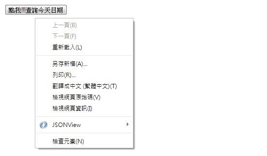
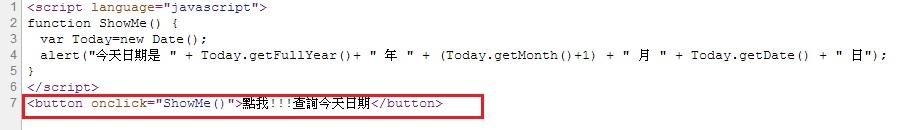
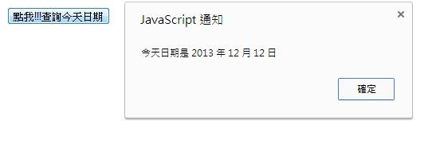

# GN1320100E 物件單純取得焦點時不要觸發脈絡變更，等使用者啟動該物件後才觸發脈絡變更

- **稽核評量碼**：GN1320100E
- **對應成功準則**：3.2.1
- **對應認證等級**：A
- **對應國際技術碼**：G107
- **類別**：General
- **訊息**：物件單純取得焦點時不要觸發脈絡變更，等使用者啟動該物件後才觸發脈絡變更
- **英文訊息**：G107: Using "activate" rather than "focus" as a trigger for changes of context

## 規則說明
任何運用HTML或XHTML無障礙的網頁，都必須要遵守此指引。

## 檢測說明
Google Chrome「檢視原始碼」顯示連結(按下右鍵→檢視原始碼)。 檢查是否使用onclick功能，當使用者利用Tab鍵選擇物件，物件取得焦點時不會直接觸發脈絡變更，需使用者啟動該物件後才觸發脈絡變更。 是否在使用tab鍵取得焦點時不會觸發結果，須點擊物件才觸發。

## 說明
無

## 範例

**圖片說明：** 瀏覽器頁面截圖，頂部顯示「點我!!!查詢今天日期」按鈕，頁面彈出右鍵選單，顯示「檢視網頁原始碼」等選項。示範透過原始碼確認按鈕是使用 `onclick` 事件（點擊啟動）而非 `onfocus` 事件（取得焦點觸發），確保物件在使用者以 Tab 鍵移至按鈕取得焦點時不會自動觸發脈絡變更。

**圖片說明：** 範例頁面的 HTML 與 JavaScript 原始碼，第1至5行定義 `ShowMe()` 函式，使用 `alert()` 顯示今天日期（格式：「今天日期是 年 月 日」）。第7行以紅框標示按鈕程式碼：`<button onclick="ShowMe()">點我!!!查詢今天日期</button>`，使用 `onclick` 屬性綁定點擊事件。示範使用「點擊啟動」而非「取得焦點觸發」，確保使用者主動點擊按鈕後才執行脈絡變更（彈出日期提示）。

**圖片說明：** 使用者點擊「點我!!!查詢今天日期」按鈕後，頁面彈出「JavaScript 通知」對話框，顯示「今天日期是 2013 年 12 月 12 日」，並有「確定」按鈕可關閉通知。示範使用者主動點擊（activate）按鈕後才觸發脈絡變更（顯示日期通知），符合「啟動後才觸發」的無障礙設計原則。
