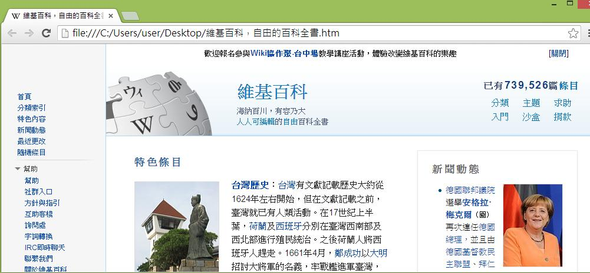
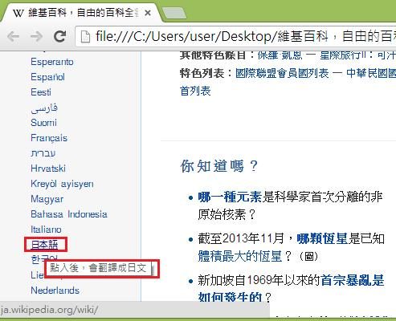
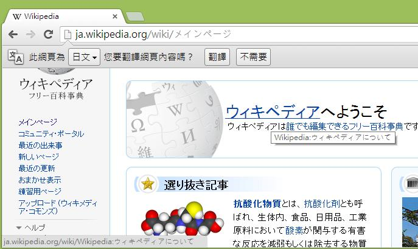

# GN1320200E 表單控制元件之行為將使網頁跳轉或變更，則在脈絡變更前需先明確描述將發生的事情

- **稽核評量碼**：GN1320200E
- **對應成功準則**：3.2.2
- **對應認證等級**：A
- **對應國際技術碼**：G13
- **類別**：General
- **訊息**：表單控制元件之行為將使網頁跳轉或變更，則在脈絡變更前需先明確描述將發生的事情
- **英文訊息**：G13: Describing what will happen before a change to a form control that causes a change of context to occur is made

## 規則說明
在所有網頁中，有會產生脈絡變更的表單控制單元生的網頁都要遵守指引。

## 檢測說明
Google Chrome瀏覽器開啟檔案。 例如維基百科，可提供各國語言翻譯的功能，例如選擇日文時，滑鼠指標移至"日本語"的連結時，會出現"點入後，會翻譯成日文"的提示。 即可在使用者選取前告知使用者選項的功能，於任何表單變更前先描述該控制元件啟動會發生什麼事。

## 說明
無

## 範例

**圖片說明：** Chrome 瀏覽器開啟維基百科繁體中文版首頁（本機檔案），顯示維基百科標誌、「已有739,526篇條目」統計，左側導覽列包含首頁、分類索引、特色內容、新聞動態、最近更改、隨機條目及幫助選項，主內容區顯示「特色條目」—台灣歷史介紹，右側「新聞動態」顯示德國聯邦議院選舉安格拉・梅克爾的新聞。示範維基百科提供多語言切換功能的範例頁面。

**圖片說明：** 維基百科頁面左側語言清單截圖，顯示 Esperanto、Español、Eesti、فارسی、Suomi、Français、עברית、Hrvatski、Kreyòl ayisyen、Magyar、Bahasa Indonesia、Italiano 等語言選項，其中「日本語」以紅框標示，滑鼠游標指向時顯示工具提示「點入後，會翻譯成日文」。示範在使用者選取語言鏈結前，先以提示文字明確描述點擊後將發生的脈絡變更（頁面將切換為日文版），讓使用者在點擊前了解操作結果。

**圖片說明：** 使用者點擊「日本語」鏈結後，頁面跳轉至 ja.wikipedia.org/wiki/メインページ（日文維基百科首頁），顯示「ウィキペディアへようこそ（歡迎來到維基百科）」標題，頁面頂部出現 Chrome 的翻譯提示列「此網頁為 日文 您要翻譯網頁內容嗎？翻譯 / 不需要」。示範點擊語言選項後頁面成功切換為日文，驗證提前告知使用者操作結果的重要性。
