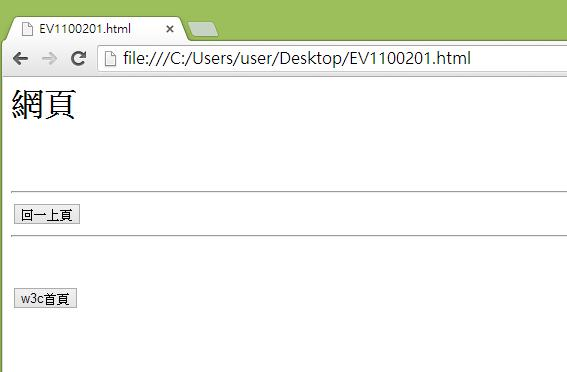
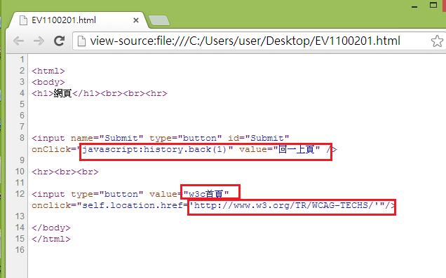
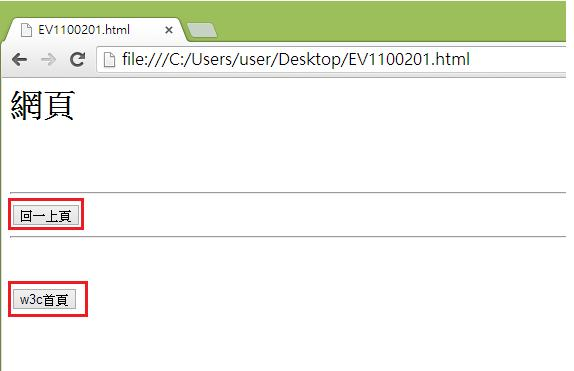

# GN1320201E 使用按鈕來做出行動並啟動脈絡變更

- **稽核評量碼**：GN1320201E
- **對應成功準則**：3.2.2
- **對應認證等級**：A
- **對應國際技術碼**：G80
- **類別**：General
- **訊息**：使用按鈕來做出行動並啟動脈絡變更
- **英文訊息**：G80: Providing a submit button to initiate a change of context / H32: Providing submit buttons / H84: Using a button with a select element to perform an action

## 規則說明
在HTML或XHTML中，若需使用按鈕來做出某動作或改變時，皆須遵守此指引。

## 檢測說明
使用Google Chrome瀏覽器開啟檔案。 點選右鍵檢視網頁原始碼。 此範例可以使用按鈕來做網頁的變更，如下圖點選按鈕可來以啟動畫面回到上一頁或w3c首頁的變更。

## 說明
無

## 範例

**圖片說明：** 瀏覽器開啟「EV1100201.html」範例頁面，顯示「網頁」主標題，頁面中有兩個按鈕：「回一上頁」按鈕（上方）與「w3c首頁」按鈕（下方），兩者以水平線分隔。示範使用明確的按鈕元素讓使用者主動觸發脈絡變更，而非透過下拉選單或焦點事件自動跳轉。

**圖片說明：** 「EV1100201.html」的 HTML 原始碼，第8行以紅框標示「回一上頁」按鈕：`<input name="Submit" type="button" id="Submit" onClick="javascript:history.back(1)" value="回一上頁" />`，`value="回一上頁"` 與 `onClick="javascript:history.back(1)"` 以紅框標示；第12行以紅框標示「w3c首頁」按鈕：`<input type="button" value="w3c首頁" onclick="self.location.href='http://www.w3.org/TR/WCAG-TECHS/'">`，`value="w3c首頁"` 與目標 URL 均以紅框標示。示範使用按鈕搭配 `onClick` 事件觸發脈絡變更（返回上一頁或跳轉至 W3C 首頁）。

**圖片說明：** 同一範例頁面截圖，「回一上頁」與「w3c首頁」兩個按鈕均以紅框標示，清楚呈現頁面上提供的兩個操作按鈕。示範使用明確標示功能的按鈕元素讓使用者了解點擊後將發生的脈絡變更，確保使用者在主動啟動按鈕前能預期操作結果。
