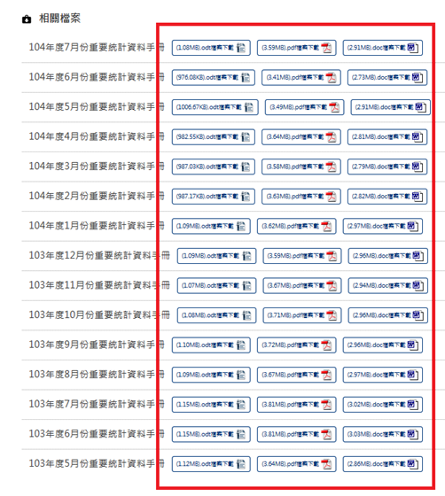
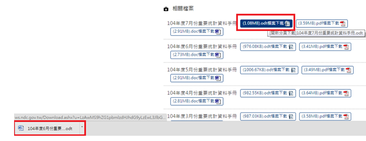
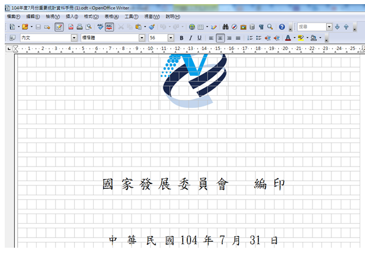

# GN1320202E 提供下載檔案格式為不需依賴特定文書商用軟體即能開啟之檔案

- **稽核評量碼**：GN1320202E
- **對應成功準則**：3.2.2
- **對應認證等級**：A
- **對應國際技術碼**：G201
- **類別**：General
- **訊息**：提供下載檔案格式為不需依賴特定文書商用軟體即能開啟之檔案
- **英文訊息**：G201: Giving users advanced warning when opening a new window

## 規則說明
檢查網頁內具有下載檔案鏈結的檔案格式，若是其檔案格式為需要向特定廠商購買和安裝的軟體才能開啟閱讀的話，即不符合此指引。為了提供使用者對於網頁內可供下載的文件有較大的相容性和可及性，以及在不用額外花費的狀況下開啟文件閱讀，應優先採用開放文件格式(ODF--CNS15251)，例如ODF(Open Document Format，開放式文件格式，包含ODT, ODS, ODP等)、PDF(Portable Document Format，可攜式文件格式)、TXT、HTML等。

## 檢測說明
參考國家發展委員會->重要統計資料 (https://www.ndc.gov.tw/Content_List.aspx?n=507E4787819DDCE6)

每一年度的重要統計資料手冊均有ODT、PDF、DOC等檔案格式下載，使用者可不必額外花費即可以開啟閱讀文件。

範例原始碼：
```html
<li>104年度7月份重要統計資料手冊
  <ul>
    <li><a href="..." TARGET="_blank" title="[開新分頁下載]104年度7月份重要統計資料手冊.odt">(1.08MB).odt檔案下載</a></li>
    <li><a href="..." TARGET="_blank" title="[開新分頁下載]104年度7月份重要統計資料手冊.pdf">(3.59MB).pdf檔案下載</a></li>
    <li><a href="..." TARGET="_blank" title="[開新分頁下載]104年度7月份重要統計資料手冊.doc">(2.91MB).doc檔案下載</a></li>
  </ul>
</li>
```

## 說明
無

## 範例



**圖片說明：** 國家發展委員會「重要統計資料」相關檔案清單截圖，以紅框標示多年度統計資料手冊的下載鏈結列表（103年5月至104年7月），每筆資料均同時提供三種格式下載按鈕：ODT 檔案（顯示檔案大小如 1.08MB）、PDF 檔案（顯示檔案大小如 3.59MB）及 DOC 檔案（顯示檔案大小如 2.91MB）。示範同時提供開放格式（ODT）、通用格式（PDF）及商用格式（DOC），讓使用者不須額外購買特定軟體即可開啟文件。



**圖片說明：** 同一統計資料下載頁面局部放大截圖，以紅框標示「104年度7月份重要統計資料手冊」第一個下載按鈕「(1.08MB).odt檔案下載」，滑鼠懸停時頁面底部狀態列顯示連結標題「(開新分頁下載)104年度7月份份重要統計資料手冊.odt」，以及下方顯示「104年6月份量要…odt」的提示。示範每個下載鏈結均附有 title 屬性說明「開新分頁下載」與完整檔案名稱，預先告知使用者點擊後將發生的脈絡變更（開新分頁）及檔案格式。



**圖片說明：** 使用免費的 OpenOffice Writer 軟體開啟「104年度7月份重要統計資料手冊(1).odt」檔案的截圖，文件封面顯示國家發展委員會標誌、「國 家 發 展 委 員 會 編 印」及「中 華 民 國 104 年 7 月 31 日」字樣。示範 ODT 開放格式文件可使用免費的 OpenOffice Writer 軟體開啟，使用者無需購買特定商用軟體（如 Microsoft Office）即可閱讀文件內容。