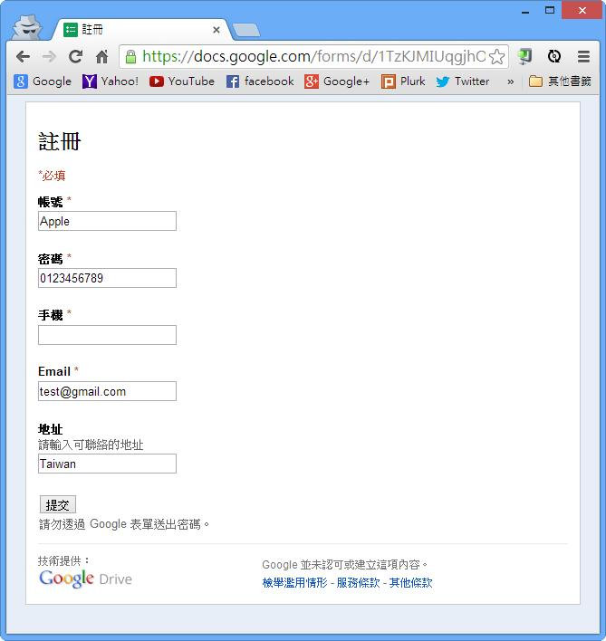
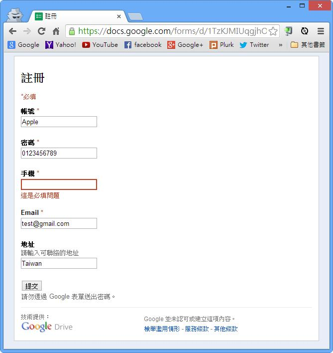

# GN1330100E 提供文字描述以指明未完成的必填欄位

- **稽核評量碼**：GN1330100E
- **對應成功準則**：3.3.1
- **對應認證等級**：A
- **對應國際技術碼**：G83
- **類別**：General
- **訊息**：提供文字描述以指明未完成的必填欄位。
- **英文訊息**：G83: Providing text descriptions to identify required fields that were not completed

## 規則說明
任何需要使用者填寫表單，且有必填欄位的網頁，都必須要符合此規定。

## 檢測說明
填寫表單測試的時候，留下必填欄位不填寫，並且按送出/提交/commit。 檢查此時是否會有文字提醒尚未完成填寫的必填欄位。 並且，之前所填寫的欄位內容不會消失。

## 說明
無

## 範例

**圖片說明：** Chrome 瀏覽器開啟 Google 表單「註冊」頁面截圖，頁面頂部標示「*必填」說明，各必填欄位標籤後標有紅色星號（*）：帳號*（已填「Apple」）、密碼*（已填「0123456789」）、手機*（空白未填）、Email*（已填「test@gmail.com」）；非必填欄位「地址」（已填「Taiwan」）無星號。頁面底部有「提交」按鈕。示範表單中以星號標示必填欄位，其中「手機」欄位為空白待填狀態。

**圖片說明：** 同一「註冊」表單，使用者未填寫「手機」必填欄位直接點擊「提交」後的截圖，「手機」輸入框以紅色框線標示，下方出現紅色文字錯誤提示「這是必填問題」，其他已填欄位（帳號「Apple」、密碼「0123456789」、Email「test@gmail.com」、地址「Taiwan」）的內容均保持不變。示範以文字描述指明未完成的必填欄位，且之前填寫的欄位內容不會消失。

**圖片說明：** 與圖片2相同的表單驗證錯誤畫面，確認「手機」欄位以紅框標示並顯示「這是必填問題」錯誤文字說明，其他已填欄位保持原有內容不變。再次示範提供清楚的文字描述來指明未完成的必填欄位位置，並保留使用者已輸入的資料，減少使用者重新填寫的負擔。
