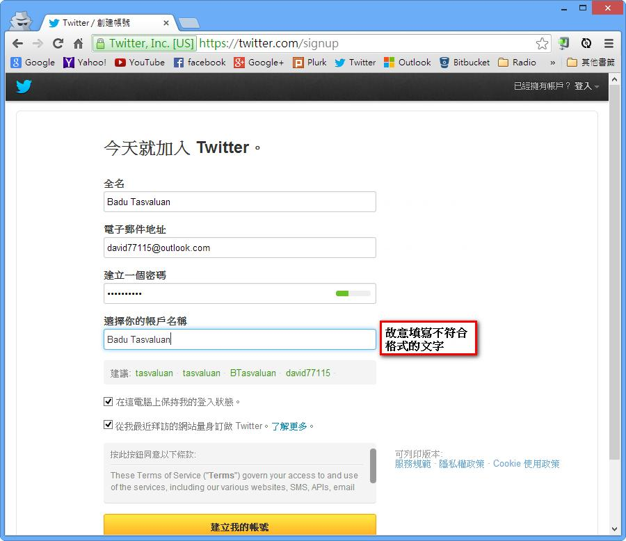
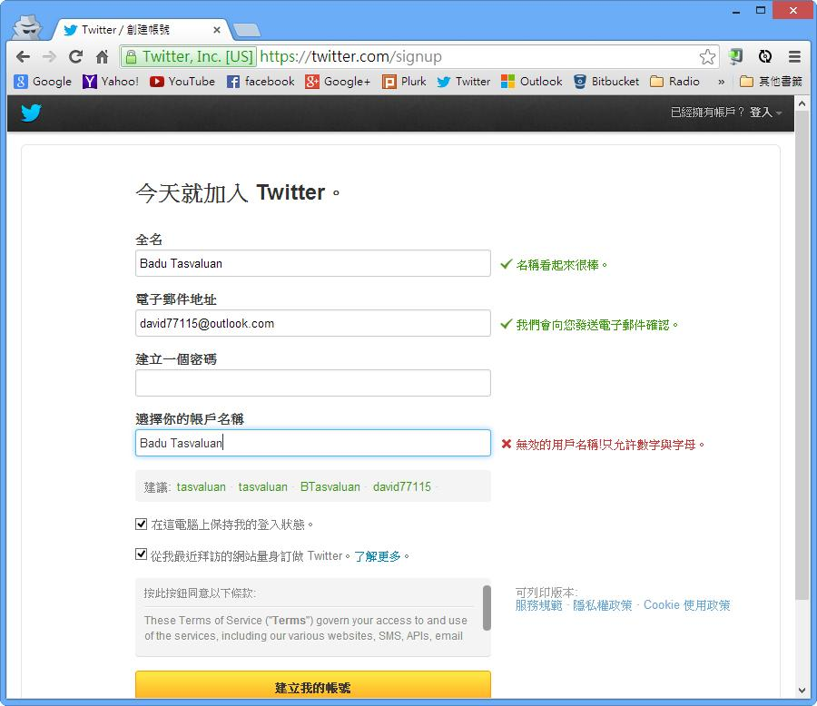
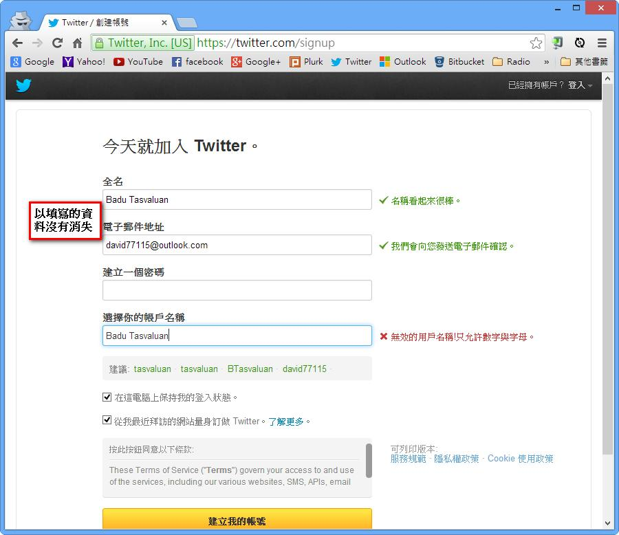

# GN1330101E 使用者輸入的內容不在允許清單中，或格式未符合所需時，均提供文字描述

- **稽核評量碼**：GN1330101E
- **對應成功準則**：3.3.1
- **對應認證等級**：A
- **對應國際技術碼**：G84
- **類別**：General
- **訊息**：使用者輸入的內容不在允許清單中，或格式未符合所需時，均提供文字描述。
- **英文訊息**：G84: Providing a text description when the user provides information that is not in the list of allowed values / G85: Providing a text description when user input falls outside the required format or values

## 規則說明
任何需要使用者填寫，且有規定填寫格式的網頁，都必須要符合此規定。

## 檢測說明
填寫表格資料，並且刻意填寫不符合規定的文字。 檢查是否會出現錯誤敘述，並且提醒使用者要如何修正錯誤。 並且，原本已經填好的資料，不會因此消失，除非是為了安全起見，將類似密碼的資訊給清除。

## 說明
無

## 範例

**圖片說明：** Chrome 瀏覽器開啟 Twitter 建立帳號頁面（https://twitter.com/signup），顯示「今天就加入 Twitter。」標題，表單包含：全名（填入「Badu Tasvaluan」）、電子郵件地址（填入「david77115@outlook.com」）、建立一個密碼（以圓點顯示）、遭選你的帳戶名稱（填入「Badu Tasvaluan」，旁邊標示「故意填寫不符合格式的文字」說明框）。下方有系統建議的帳戶名稱選項。示範在帳戶名稱欄位故意填寫包含空格的格式錯誤內容（Twitter 帳號不允許空格）。

**圖片說明：** Twitter 建立帳號表單驗證後的截圖，全名欄位右側顯示綠色勾勾與「✓ 名稱看起來很棒。」；電子郵件欄位右側顯示「✓ 我們會向您發送電子郵件確認。」；密碼欄位清空（安全考量）；帳戶名稱「Badu Tasvaluan」欄位以藍色框線標示，右側顯示紅色叉號與錯誤文字「✗ 無效的用戶名稱！只允許數字與字母。」，下方提供系統建議的合法帳戶名稱選項。示範當輸入格式不符合規定時，以文字描述明確說明錯誤原因及允許的格式。

**圖片說明：** 同一表單驗證結果截圖，左側標示「以填寫的資料沒有消失」說明框，全名欄位仍顯示「Badu Tasvaluan」（✓ 名稱看起來很棒），電子郵件欄位仍顯示「david77115@outlook.com」（✓ 我們會向您發送電子郵件確認），密碼欄位清空（安全考量），帳戶名稱欄位顯示錯誤（✗ 無效的用戶名稱！只允許數字與字母）。示範出現錯誤時，除密碼欄位外，使用者已填入的資料均保持不變，減少重新填寫的負擔。
