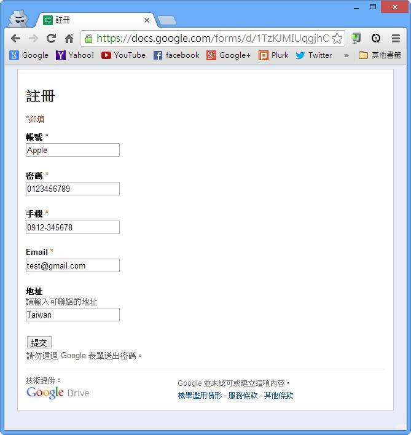
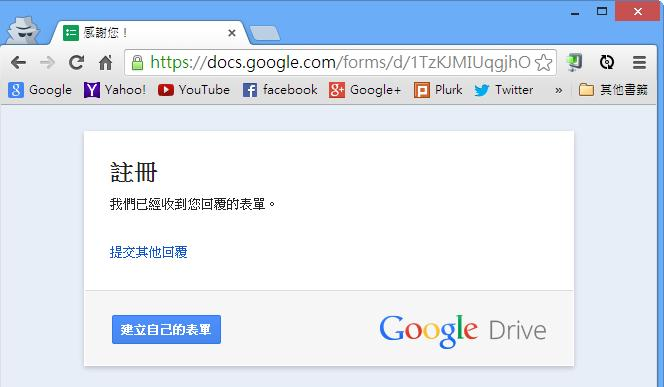

# GN1330102E 資料成功送出後，提供成功的回饋

- **稽核評量碼**：GN1330102E
- **對應成功準則**：3.3.1
- **對應認證等級**：A
- **對應國際技術碼**：G199
- **類別**：General
- **訊息**：資料成功送出後，提供成功的回饋
- **英文訊息**：G199: Providing success feedback when data is submitted successfully

## 規則說明
任何接收使用者資訊的網頁，都必須要符合此規定。

## 檢測說明
正確的填寫表單，符合格式規定，並且將必須完成的欄位都填滿。按下送出。 檢查網頁是否呈現"送出成功"等確認訊息。

## 說明
無

## 範例

**圖片說明：** Chrome 瀏覽器開啟 Google 表單「註冊」頁面截圖，頁面頂部標示「*必填」，各必填欄位均已正確填寫：帳號*「Apple」、密碼*「0123456789」、手機*「0912-345678」、Email*「test@gmail.com」；非必填欄位「地址」填入「Taiwan」。頁面底部有「提交」按鈕與「請勿透過 Google 表單送出密碼。」提示。示範所有必填欄位均已完整填寫、格式正確，準備送出表單。

**圖片說明：** 使用者點擊「提交」按鈕後，頁面跳轉至成功確認頁面（瀏覽器標籤顯示「感謝您！」），頁面顯示「註冊」標題，下方以文字說明「我們已經收到您回覆的表單。」，並提供「提交其他回覆」鏈結及「建立自己的表單」按鈕。示範資料成功送出後，提供明確的成功回饋訊息，讓使用者確認表單已成功提交。
