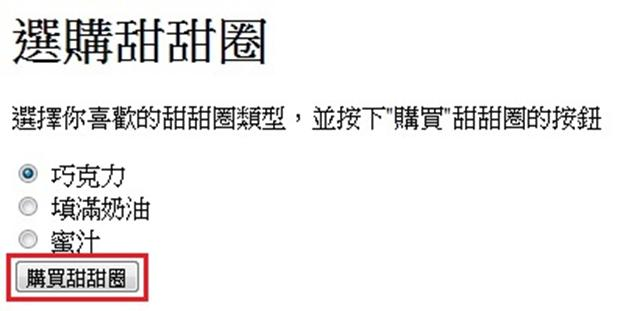

# GN1330200E 在使用者送出資料前，先描述會發生什麼事

- **稽核評量碼**：GN1330200E
- **對應成功準則**：3.3.2
- **對應認證等級**：A
- **對應國際技術碼**：G13
- **類別**：General
- **訊息**：在使用者送出資料前，先描述會發生什麼事
- **英文訊息**：G13: Describing what will happen before a change to a form control that causes a change of context to occur is made

## 規則說明
任何在HTML或XHTML的網頁內，出現需要使用者選擇項目或是提供資料並提交的按鈕時，都需要遵守此指引。

## 檢測說明
檢查按鈕上面是否有說明按下後會發生什麼事。

## 說明
無

## 範例

**圖片說明：** 網頁「選購甜甜圈」表單截圖，頁面標題為「選購甜甜圈」，說明文字為「選擇你喜歡的甜甜圈類型，並按下"購買"甜甜圈的按鈕」，清楚告知使用者送出資料後將會發生什麼事（購買甜甜圈）。下方列出三個單選按鈕選項：巧克力（已選取）、填滿奶油、蜜汁，最下方以紅框標示「購買甜甜圈」送出按鈕。示範在使用者送出資料前，先以說明文字描述按下按鈕後將發生的動作（購買所選甜甜圈），讓使用者清楚了解操作後果。
