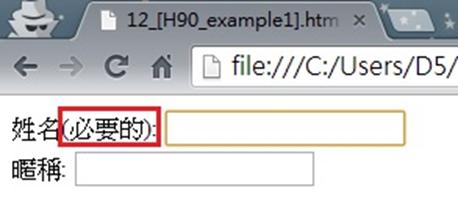

# GN1330201E 提供文字描述以指明需填寫的必填欄位

- **稽核評量碼**：GN1330201E
- **對應成功準則**：3.3.2
- **對應認證等級**：A
- **對應國際技術碼**：G184
- **類別**：General
- **訊息**：提供文字描述以指明需填寫的必填欄位
- **英文訊息**：G184: Providing text instructions at the beginning of a form or set of fields that describes the necessary input

## 規則說明
任何在HTML或XHTML的網頁內，出現需要使用者填寫資料的表單，需在必填的欄位上提供文字描述以指明。

## 檢測說明
檢查表單上需要使用者必須填上的欄位是否有註加說明。

## 說明
無

## 範例

**圖片說明：** 瀏覽器開啟「12_[H90_example1].html」範例頁面，顯示一個簡單的表單：第一個欄位標籤「姓名(必要的):」以紅框標示「必要的」文字，對應的輸入框顯示黃色背景以醒目呈現；第二個欄位標籤「暱稱:」為一般白色背景的非必填欄位。示範在必填欄位標籤中直接以文字「(必要的)」明確指明該欄位為必填，讓使用者在填寫前即能識別必填欄位的位置。
