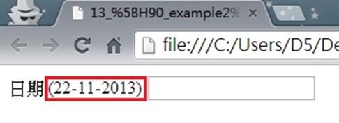

# GN1330202E 提供預期的資料格式與範例

- **稽核評量碼**：GN1330202E
- **對應成功準則**：3.3.2
- **對應認證等級**：A
- **對應國際技術碼**：G89
- **類別**：General
- **訊息**：提供預期的資料格式與範例
- **英文訊息**：G89: Providing expected data format and example

## 規則說明
任何在HTML或XHTML的網頁內，出現需要使用者填寫資料的表單，如果有需要固定的格式，需在欄位上提供預期使用者填入的格式範例。

## 檢測說明
檢查表單上需要固定格式的資料欄位上是否有提供格式範例。

## 說明
無

## 範例

**圖片說明：** 瀏覽器開啟「13_[H90_example2].html」範例頁面，顯示一個日期輸入表單欄位：標籤文字「日期」後方以紅框標示「(22-11-2013)」格式範例，旁邊為空白輸入框供使用者填寫。格式範例說明日期應按照「日-月-年」（DD-MM-YYYY）格式輸入。示範在有固定格式要求的輸入欄位標籤旁提供預期的資料格式範例，讓使用者在填寫前即了解正確的輸入格式。
