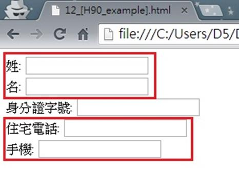

# GN1330203E 妥善定位描述性標籤的位置，使關連性的可預期性最大化

- **稽核評量碼**：GN1330203E
- **對應成功準則**：3.3.2
- **對應認證等級**：A
- **對應國際技術碼**：G131
- **類別**：General
- **訊息**：妥善定位描述性標籤的位置，使關連性的可預期性最大化
- **英文訊息**：G131: Providing descriptive labels / G162: Positioning labels to maximize predictability of relationships

## 規則說明
任何在HTML或XHTML的網頁內，如果描述性的標籤是有關連性的，必須妥善定位相關的標籤，讓使用者預期找到標籤正確位置的成功率最大化。

## 檢測說明
檢查表單上有關連性的描述標籤是否有擺在適當位置(相鄰)。

## 說明
無

## 範例

**圖片說明：** 瀏覽器開啟「12_[H90_example].html」範例頁面，顯示一個個人資料填寫表單。頁面以紅框標示三個相關欄位組合：第一個紅框包含「姓:」與「名:」兩個相鄰的標籤與輸入框，表示姓名的兩個關聯欄位緊鄰排列；第二個紅框包含「住宅電話:」與「手機:」兩個相鄰欄位，將電話類型的相關欄位集中在一起；中間「身分證字號:」則為獨立欄位。示範將有關連性的描述性標籤（如姓/名、住宅電話/手機）妥善定位在相鄰位置，讓使用者能直觀預期標籤與輸入欄位的對應關係。
