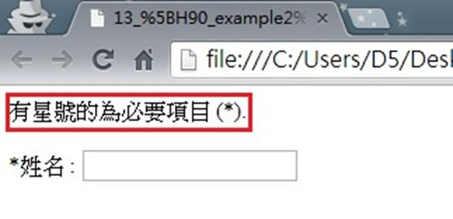

# GN1330205E 在表單或一組表單欄位開頭處提供文字指示來描述必要的輸入欄位

- **稽核評量碼**：GN1330205E
- **對應成功準則**：3.3.2
- **對應認證等級**：A
- **對應國際技術碼**：G184
- **類別**：General
- **訊息**：在表單或一組表單欄位開頭處提供文字指示來描述必要的輸入欄位
- **英文訊息**：G184: Providing text instructions at the beginning of a form or set of fields that describes the necessary input

## 規則說明
任何在HTML或XHTML的網頁內，出現需要使用者填寫資料的表單，需在表單開頭處提供文字描述必要的輸入欄位。

## 檢測說明
檢查表單上有需要使用者必須填上的欄位時，是否有在表單開頭處提供文字描述指示必要的輸入欄位。

## 說明
無

## 範例

**圖片說明：** 瀏覽器開啟「13_[H90_example2].html」範例頁面，顯示一個簡單表單。以紅框標示表單最頂部的文字指示「有星號的為必要項目 (*).」，說明凡是標籤前有星號（*）的欄位均為必填項目。下方顯示「*姓名:」欄位（標籤前有星號）對應的空白輸入框。示範在表單開頭處先提供文字說明，告知使用者哪些欄位為必填（以星號標示），讓使用者在開始填寫前即了解必填欄位的識別方式。
