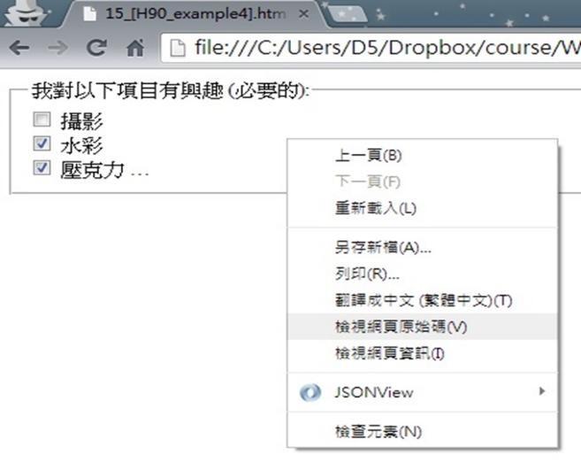
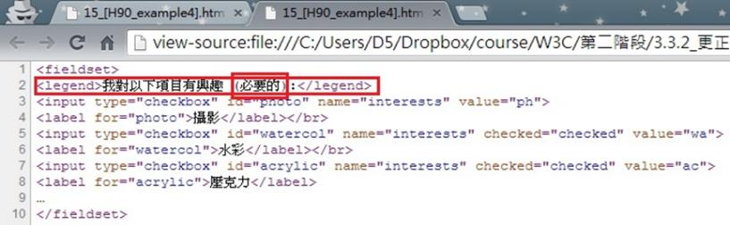

# GN1330206E 指出必需的表單控制元件

- **稽核評量碼**：GN1330206E
- **對應成功準則**：3.3.2
- **對應認證等級**：A
- **對應國際技術碼**：H90
- **類別**：General
- **訊息**：指出必需的表單控制元件
- **英文訊息**：H90: Indicating required form controls using label or legend / ARIA9: Using aria-labelledby to concatenate a label from several text nodes

## 規則說明
任何在HTML或XHTML的網頁內，出現必需要使用者進行選擇的表單，需在表單開頭處提供文字指出必需的表單控制元件。

## 檢測說明
範例1：指出單選按鈕組或複選框控件所需的狀態

使用Google Chrome「檢視原始碼」顯示連結(按下右鍵→檢視原始碼)。 檢查表單上描述指出必需的表單控制元件的文字是否有在`<legend>`標籤內。

範例2：使用`<aria-labelledby>`關聯相關輸入的行列標題

```html
<table>
  <tr>
    <td></td>
    <th id="tpayer">Taxpayer</th>
    <th id="sp">Spouse</th>
  </tr>
  <tr>
    <th id="gross">W2 Gross</th>
    <td><input type="text" size="20" aria-labelledby="tpayer gross" /></td>
    <td><input type="text" size="20" aria-labelledby="sp gross" /></td>
  </tr>
  <tr>
    <th id="div">Dividends</th>
    <td><input type="text" size="20" aria-labelledby="tpayer div" /></td>
    <td><input type="text" size="20" aria-labelledby="sp div" /></td>
  </tr>
</table>
```

## 說明
無

## 範例



**圖片說明：** 瀏覽器開啟「15_[H90_example4].html」範例頁面，以方框包覆顯示「我對以下項目有興趣 (必要的):」為標題的 fieldset 群組，內含三個複選框選項：「攝影」（未選取）、「水彩」（已勾選）、「壓克力...」（已勾選）。群組標題中「(必要的)」文字明確指出此複選框組為必填項目。頁面彈出右鍵選單，「檢視網頁原始碼」選項反白標示，示範可透過原始碼確認必要性說明是否放在 `<legend>` 標籤內。



**圖片說明：** 「15_[H90_example4].html」的 HTML 原始碼，第2行以紅框標示 `<legend>` 元素：`<legend>我對以下項目有興趣 <span>（必要的）</span>:</legend>`，其中「必要的」文字以獨立紅框標示。第3至8行為三個複選框（`<input type="checkbox">`）及對應的 `<label>` 標籤：攝影（id="photo"）、水彩（id="watercol"，checked）、壓克力（id="acrylic"，checked）。示範在 `<legend>` 標籤內包含「(必要的)」文字，明確指出整個複選框群組為必填，讓輔助技術使用者能了解此控制元件組的必填狀態。
