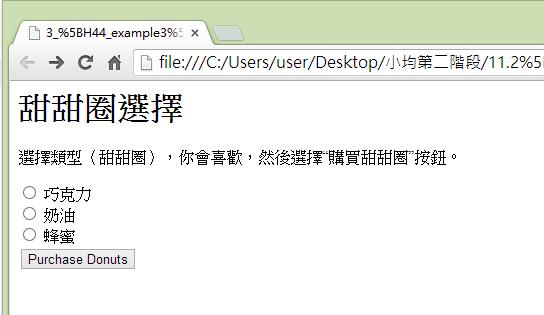
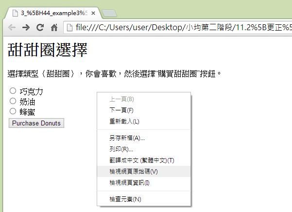
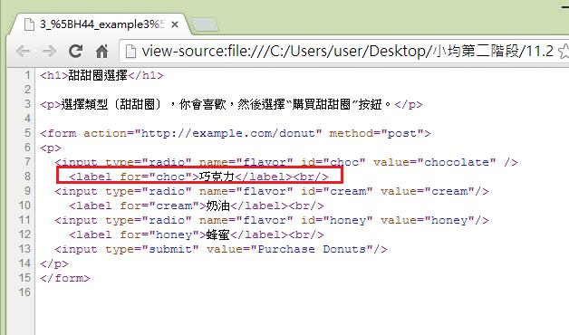
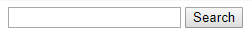

# GN1410200E 使用者介面元件應暴露名稱與角色，允許直接設定可由使用者設定的屬性，並在變更時提供通知

- **稽核評量碼**：GN1410200E
- **對應成功準則**：4.1.2
- **對應認證等級**：A
- **對應國際技術碼**：G10
- **類別**：General
- **訊息**：使用者介面元件應暴露名稱與角色，允許直接設定可由使用者設定的屬性，並在變更時提供通知
- **英文訊息**：G10: Creating components using a technology that supports the accessibility API features / G108: Using markup features to expose the name and role / G135: Using the accessibility API features of a technology to expose names and roles / ARIA4: Using a WAI-ARIA role to expose the role of a user interface component / ARIA5: Using WAI-ARIA state and property attributes to expose the state of a user interface component / ARIA14: Using aria-label to provide an invisible label / ARIA16: Using aria-labelledby to provide a name for user interface controls / ARIA19: Using ARIA role=alert or Live Regions to Identify Errors

## 規則說明
此標記技術可公開名稱及屬性，允許使用者自行設定屬性，適用於HTML或XHTML，皆須遵守此指引。

## 檢測說明
範例1：允許使用者自行設定屬性

使用Google Chrome瀏覽器開啟檔案。 點選右鍵檢視網頁原始碼。 從程式碼中，可以自行更改選項或添加選項，且允許使用者自行設定屬性。

範例2：使用`<aria-labelledby>`在簡單文本字段

```html
<input name="searchtxt" type="text" aria-labelledby="searchbtn">
<input name="searchbtn" id="searchbtn" type="submit" value="Search">
```

## 說明
無

## 範例



**圖片說明：** 瀏覽器開啟本機檔案的「甜甜圈選擇」範例頁面截圖，頁面標題為「甜甜圈選擇」，說明文字為「選擇類型〈甜甜圈〉，你會喜歡，然後選擇『購買甜甜圈』按鈕。」下方列出三個單選按鈕選項：「巧克力」、「奶油」、「蜂蜜」，以及一個「Purchase Donuts」提交按鈕。示範使用標準 HTML 表單元件（radio button 與 submit button），透過原生 HTML 標記技術公開使用者介面元件的名稱與角色，允許使用者自行設定屬性。



**圖片說明：** 同一個「甜甜圈選擇」範例頁面截圖，頁面顯示相同的三個單選按鈕（巧克力、奶油、蜂蜜）與「Purchase Donuts」按鈕。畫面中間彈出滑鼠右鍵快捷選單，選單項目包含「上一頁」、「下一頁」、「重新載入」、「另存新檔」、「列印」、「翻譯成中文（繁體中文）」、「檢視網頁原始碼」（已反白標示）、「檢視網頁資訊」、「檢查元素」等選項。示範使用 Google Chrome 瀏覽器的右鍵選單選擇「檢視網頁原始碼」，以查看 HTML 標記如何公開元件名稱與角色屬性。



**圖片說明：** 瀏覽器以「原始碼」模式開啟「甜甜圈選擇」範例頁面的 HTML 程式碼截圖，位址列顯示 view-source 路徑。程式碼第1行為 `<h1>甜甜圈選擇</h1>`，第3行為說明文字段落，第5行為 `<form action="http://example.com/donut" method="post">`，第7至12行為三個 radio button 輸入欄位，第8行以紅框標示 `<label for="choc">巧克力</label>` 示範使用 `<label>` 標籤與 `for` 屬性正確關聯表單元件，第9-10行為「奶油」選項，第11-12行為「蜂蜜」選項，第13行為提交按鈕。示範透過 HTML 標記技術正確公開使用者介面元件的名稱（`<label>`）與角色（`type="radio"`），允許輔助科技識別並操作這些元件。



**圖片說明：** 簡單的搜尋介面截圖，顯示一個空白的文字輸入框與旁邊的「Search」提交按鈕，無其他標籤文字。示範使用 `aria-labelledby` 屬性，以相鄰的提交按鈕（`id="searchbtn"`）作為搜尋文字輸入框（`aria-labelledby="searchbtn"`）的不可見標籤，透過 WAI-ARIA 屬性公開使用者介面元件的名稱，供輔助科技識別輸入框用途。