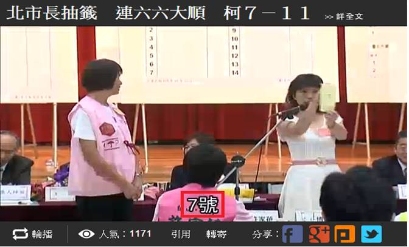

# GN2120400E 為現場的同步媒體建立字幕

- **稽核評量碼**：GN2120400E
- **對應成功準則**：1.2.4
- **對應認證等級**：AA
- **對應國際技術碼**：G9
- **類別**：General
- **訊息**：為現場的同步媒體建立字幕
- **英文訊息**：G9: Creating captions for live synchronized media

## 規則說明

網頁中如果有嵌入即時live多媒體，需要有字幕輔助。

## 檢測說明

影片中下方有字幕輔助。

## 說明

無

## 範例

**圖片說明：** 展示現場直播視訊的畫面，顯示一個戶外舞台場景，兩名主持人分別站在紅色和白色的舞台區域，其中一人穿著粉色上衣。頁面上方顯示中文標題「北市長抽籤 連六六大順 柯7－11」，左下角顯示直播統計資訊（「編播」、「人氣：1171」、「引用」、「轉享」、「分享」等社交媒體按鈕），右下角標註「7號號」。此圖展示即時直播內容的呈現方式，應配備實時字幕以確保聽覺障礙使用者能理解現場內容。
