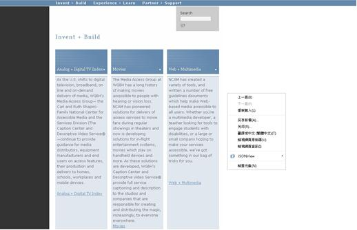
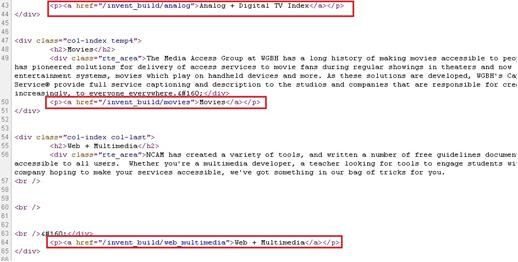

# GN2120500E 為同步媒體中所有的視訊內容提供具有音訊描述或延伸音訊描述，或提供使用者可選取、且含有音訊描述的第二音軌

- **稽核評量碼**：GN2120500E
- **對應成功準則**：1.2.5
- **對應認證等級**：AA
- **對應國際技術碼**：G68
- **類別**：General
- **訊息**：為同步媒體中所有的視訊內容提供具有音訊描述或延伸音訊描述，或提供使用者可選取、且含有音訊描述的第二音軌
- **英文訊息**：G8: Providing a movie with extended audio descriptions / G78: Providing a second, user-selectable, audio track that includes audio descriptions / G173: Providing a version of a movie with audio descriptions / H96: Using the track element to provide audio descriptions

## 規則說明

任何運用HTML或XHTML時序媒體及同步媒體的網頁，都必須要遵守此指引。

## 檢測說明

使用Google Chrome「檢視原始碼」顯示連結 (按下右鍵→檢視原始碼)。

檢查是否有提供具有音訊描述或額外音訊描述的電影，或提供使用者可選取、且含有音訊描述的第二音軌，並點擊連結來驗證。

## 說明

無

## 範例

**圖片說明：** 展示媒體存取組織（Media Access Group）網頁，顯示三個主要內容區塊：「Making a Digital TV Index」、「Media」和「and a Multimedia」。每個區塊包含詳細的文字說明，敘述媒體無障礙服務的提供情況、NCAM的成立背景及其工作。頁面右側附有選單，包含「上面回」、「下面」、「含括內文」等導航選項，以及編號列表（03、05、08等）。此圖展示為同步媒體提供音訊描述的網頁結構。

**圖片說明：** 展示HTML原始碼實現。代碼中標示多個<a>標籤，重點以紅色方框標記，包含：(1)「<a href="/movies/digitalliving/analog + digital tv index</a>」；(2)「<a href="#...MultiMedia">Media + Multimedia</a>」；(3)「<a href="/more...</Moviee</a>」等連結。這些代碼表示為同步媒體提供了音訊描述的替代軌道或連結，確保所有視訊內容都有對應的音訊描述版本可供選取。
