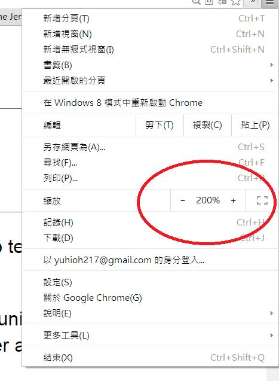

# GN2140400E 使用具有支援縮放功能且容易取得的使用者代理的科技，或者在頁面上提供可讓使用者變大所有文字尺寸到百分之兩百為止的控制元件

- **稽核評量碼**：GN2140400E
- **對應成功準則**：1.4.4
- **對應認證等級**：AA
- **對應國際技術碼**：G142、G178、SCR34
- **類別**：General
- **訊息**：使用具有支援縮放功能且容易取得的使用者代理的科技，或者在頁面上提供可讓使用者變大所有文字尺寸到百分之兩百為止的控制元件
- **英文訊息**：G142: Using a technology that has commonly-available user agents that support zoom / G178: Providing controls on the Web page that allow users to incrementally change the size of all text on the page up to 200 percent / SCR34: Calculating size and position in a way that scales with text size

## 規則說明

所有網頁元件必須符合此指引。

## 檢測說明

將所需的網頁用Google Chrome、IE、Opera這些具有提供放大縮小功能的網頁瀏覽器開啟。

將網頁透過瀏覽器或是網頁提供的放大功能放大至200%。

檢查是否所有元件都可以適用於此放大縮小技術。

## 說明

無
## 範例

**圖片說明：** 介面元素或設計示例的中等規模截圖。