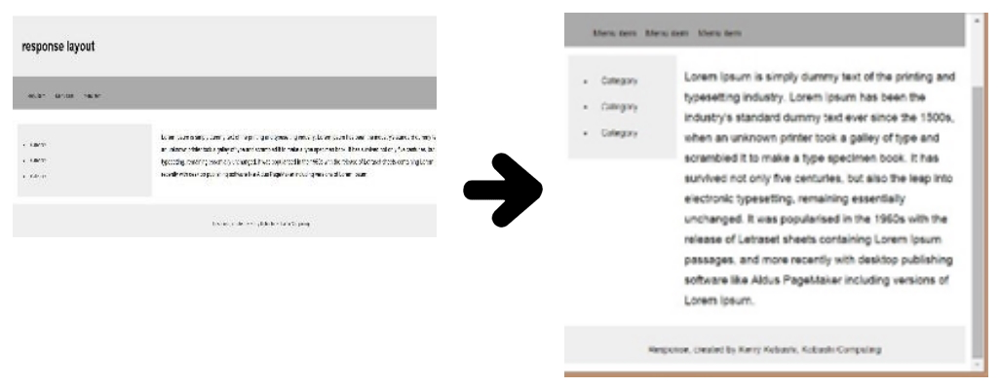

# GN2140401E 使用流動版面設計，或者確認當文字尺寸變更而文字容器尺寸並未變更時，不會喪失任何內容或功能

- **稽核評量碼**：GN2140401E
- **對應成功準則**：1.4.4
- **對應認證等級**：AA
- **對應國際技術碼**：G146、G179
- **類別**：General
- **訊息**：使用流動版面設計，或者確認當文字尺寸變更而文字容器尺寸並未變更時，不會喪失任何內容或功能
- **英文訊息**：G146: Using liquid layout / G179: Ensuring that there is no loss of content or functionality when the text resizes and text containers do not change their width

## 規則說明

所有設計有流動版面的網頁都必須遵守此指引。

## 檢測說明

使用工具將網頁打開。

放大網頁頁面至200%。

檢查所有網頁元件的功能是否能正常執行。

## 說明

無
## 範例

**圖片說明：** 介面元素或設計示例的中等規模截圖。