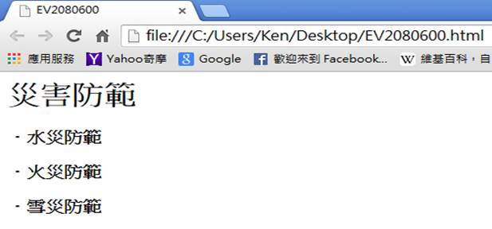
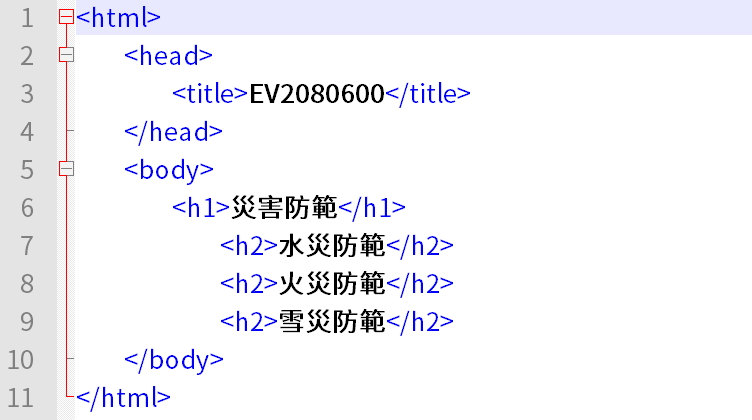

# GN2240600E 提供描述性的標題(headings)

- **稽核評量碼**：GN2240600E
- **對應成功準則**：2.4.6
- **對應認證等級**：AA
- **對應國際技術碼**：G130
- **類別**：General
- **訊息**：提供描述性的標題(headings)
- **英文訊息**：G130: Providing descriptive headings

## 規則說明

HTML提供六種標頭(Heading)環境，由大到小依序有H1, H2, H3, H4, H5和H6六個等級。標題文字視情況會用大號字、或者用粗體字，所有標題文字原則上都是靠左排齊。

## 檢測說明

1. 使用Google Chrome瀏覽器開啟檔案。此檔案主題為災害防範，底下的小主題分為水災、火災、雪災等防範。
2. 可點選右鍵檢視網頁原始碼。主題"災害防範"用H1的標頭，底下的小主題則使用H2標頭。

## 說明

無

## 範例

**圖片說明：** 瀏覽器開啟「EV2080600.html」範例頁面，顯示主標題「災害防範」（較大字體）以及三個次標題：「水災防範」、「火災防範」、「雪災防範」（以項目符號「·」呈現）。示範使用描述性標題來組織頁面內容，主題與子主題層次分明，讓使用者能快速了解頁面結構。

**圖片說明：** 「EV2080600.html」的 HTML 原始碼，共11行：第6行 `<h1>災害防範</h1>` 為一級標題，第7至9行分別為 `<h2>水災防範</h2>`、`<h2>火災防範</h2>`、`<h2>雪災防範</h2>` 三個二級標題。示範使用 H1 標記主要主題「災害防範」，再以 H2 標記三個子主題，透過描述性標題層次結構協助使用者理解頁面內容的組織方式。
