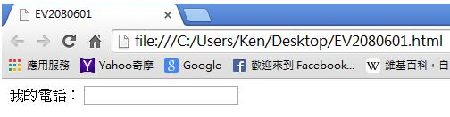
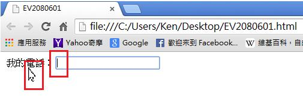
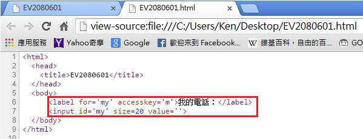

# GN2240601E 提供描述性的標籤(label)

- **稽核評量碼**：GN2240601E
- **對應成功準則**：2.4.6
- **對應認證等級**：AA
- **對應國際技術碼**：G131
- **類別**：General
- **訊息**：提供描述性的標籤(label)
- **英文訊息**：G131: Providing descriptive labels

## 規則說明

用來設定輸入元件的標籤(label)，標籤可以是文字或圖片。每一個標籤只能指定一個輸入元件。使用者可以點擊標籤，選擇輸入元件。

## 檢測說明

1. 使用Google Chrome瀏覽器開啟網頁。
2. 將滑鼠點向標籤"我的電話："，則游標就會在輸入行上，等待使用者輸入了。
3. 可點選右鍵檢視網頁原始碼。程式碼中"我的電話："就是用來設定輸入元件的標籤。

## 說明

無

## 範例

**圖片說明：** 瀏覽器開啟「EV2080601.html」範例頁面，頁面顯示「我的電話：」標籤文字與右側輸入框。輸入框呈現空白待輸入狀態，標籤清楚描述輸入元件的用途（電話號碼輸入欄位），示範使用描述性標籤協助使用者了解表單欄位的目的。

**圖片說明：** 同一範例頁面截圖，滑鼠游標點擊「我的電話：」標籤文字後，輸入框獲得焦點（輸入游標顯示於框內），且「我的電話：」文字呈現底線樣式表示可點擊。示範透過 `<label>` 元素與輸入欄位的關聯，使用者點擊標籤即可將焦點移至對應輸入框，提升表單操作的易用性。

**圖片說明：** 「EV2080601.html」的 HTML 原始碼，第6至7行以紅框標示：`<label for='my' accesskey='m'>我的電話：</label>` 與 `<input id='my' size=20 value=''>`。示範使用 `<label>` 的 `for` 屬性對應輸入元件的 `id`，以及 `accesskey` 屬性設定鍵盤快速鍵，提供清楚描述性標籤讓使用者了解輸入欄位的用途。
