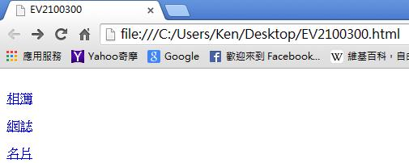
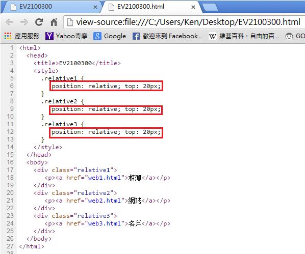
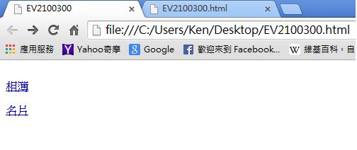

# GN2320300E 每一次會重複出現的元件出現時，均按照相同的相對順序來呈現

- **稽核評量碼**：GN2320300E
- **對應成功準則**：3.2.3
- **對應認證等級**：AA
- **對應國際技術碼**：G61
- **類別**：General
- **訊息**：每一次會重複出現的元件出現時，均按照相同的相對順序來呈現
- **英文訊息**：G61: Presenting repeated components in the same relative order each time they appear

## 規則說明
將重複出現的元件按照相同的相對順序來呈現，其它元件可以在它們之間加入或刪除，但那些元件的順序仍不會改變。

## 檢測說明
使用Google Chrome瀏覽器開啟檔案。範例中相簿、網誌、名片是以相對順序來呈現。 點選右鍵檢視網頁原始碼。此範例是使用CSS的位置屬性(Position)：Relative(相對位置)。 可把程式碼中的網誌部分刪除(第20~22行)，則剩下元件的順序仍不會改變。

## 說明
無

## 範例

**圖片說明：** 瀏覽器開啟「EV2100300.html」範例頁面，顯示三個鏈結依序排列：「相簿」、「網誌」、「名片」，各項目均以藍色鏈結呈現，依照固定的相對順序由上而下排列。示範重複出現的導覽元件按照相同的相對順序呈現。

**圖片說明：** 「EV2100300.html」的 HTML 原始碼，第5至13行以紅框分別標示三個 CSS 類別的位置屬性：`.relative1`、`.relative2`、`.relative3` 均設定 `position: relative; top: 20px;`。第17至25行為 HTML 主體，三個 `
` 區塊依序包含「相簿」（href="web1.html"）、「網誌」（href="web2.html"）、「名片」（href="web3.html"）鏈結，以相對位置（Relative）佈局確保元件依相同順序呈現。

**圖片說明：** 同一範例頁面截圖，刪除「網誌」區塊（第20至22行程式碼）後的顯示結果，頁面只剩「相簿」與「名片」兩個鏈結，但兩者仍保持原有的相對順序（相簿在上、名片在下）。示範即使在元件之間插入或刪除其他元件，剩餘的重複元件相對順序仍維持不變，符合一致性導覽的無障礙要求。
