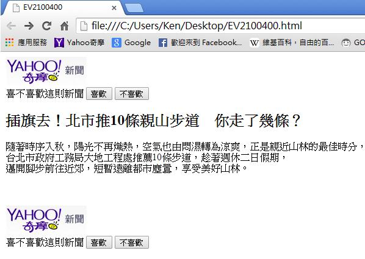
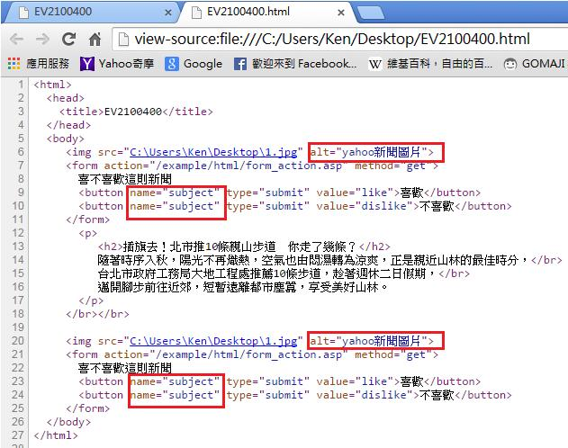

# GN2320400E 按照具有相同功能的內容，一致地使用標籤、名稱、替代文字

- **稽核評量碼**：GN2320400E
- **對應成功準則**：3.2.4
- **對應認證等級**：AA
- **對應國際技術碼**：G197
- **類別**：General
- **訊息**：按照具有相同功能的內容，一致地使用標籤、名稱、替代文字
- **英文訊息**：G197: Using labels, names, and text alternatives consistently for content that has the same functionality

## 規則說明
當一個網頁具有相同功能的內容時，則label、name、alt等屬性內容也要一致。

## 檢測說明
使用Google Chrome瀏覽器開啟檔案。範例中新聞的上方和下方有相同的內容。 點選右鍵檢視網頁原始碼。可以看到name、alt屬性內容也是一致的。

## 說明
無

## 範例

**圖片說明：** 瀏覽器開啟「EV2100400.html」範例頁面，顯示 YAHOO! 奇摩新聞版面，頁面上下各有一組相同的功能元件：YAHOO! 奇摩新聞標誌（圖片）與「喜不喜歡這則新聞」互動按鈕組（「喜歡」與「不喜歡」按鈕），中間顯示新聞標題「插旗去！北市推10條親山步道　你走了幾條？」及新聞內容。示範在同一頁面中，相同功能的元件（新聞標誌圖片、評分按鈕）出現兩次，應使用一致的標籤、名稱及替代文字。

**圖片說明：** 「EV2100400.html」的 HTML 原始碼，第6行與第20行分別以紅框標示兩個相同的圖片標籤：``，兩者 `alt` 屬性均為「yahoo新聞圖片」保持一致；第9至10行與第23至24行以紅框標示兩組按鈕，`name="subject"` 屬性在上下兩組中均相同，「喜歡」與「不喜歡」按鈕的名稱一致。示範具有相同功能的圖片 alt 屬性、表單按鈕 name 屬性均保持一致，讓輔助技術使用者能在不同位置識別相同功能的元件。
