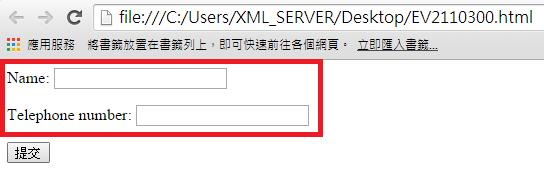
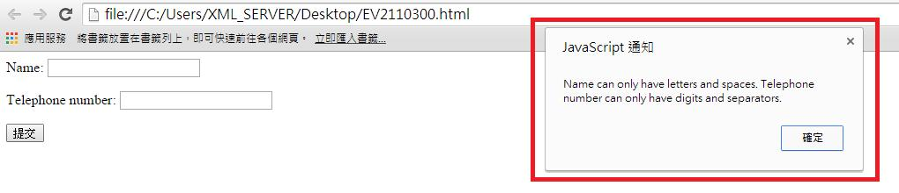

# GN2330300E 提供文字描述以指明未完成的必填欄位，並建立可以讓使用者跳到出錯之處的機制

- **稽核評量碼**：GN2330300E
- **對應成功準則**：3.3.3
- **對應認證等級**：AA
- **對應國際技術碼**：G83
- **類別**：General
- **訊息**：提供文字描述以指明未完成的必填欄位，並建立可以讓使用者跳到出錯之處的機制
- **英文訊息**：G83: Providing text descriptions to identify required fields that were not completed / G139: Creating a mechanism that allows users to jump to errors / SCR32: Providing client-side validation and adding error text via the DOM / ARIA1: Using the aria-describedby property to provide a descriptive label for user interface controls / ARIA18: Using aria-alertdialog to Identify Errors / ARIA21: Using Aria-Invalid to Indicate An Error Field

## 規則說明
任何在HTML或XHTML的網頁內，出現需要使用者填寫資料的表單，需在表單填完後檢查輸入的資料是否都以填寫，如有錯誤則透過檢查機制告訴使用者錯誤欄位，並引導至錯誤欄位重新填寫。

## 檢測說明
範例1：提供文字描述以指明未完成的必填欄位

欄位未輸入訊息。 按下提交鍵後，會跳出錯誤訊息：輸入格式錯誤或者此處不能為空白。 使用Google Chrome「檢視原始碼」顯示連結(按下右鍵→檢視原始碼)，檢查是否具有警示出錯的機制。

## 說明
無

## 範例

**圖片說明：** 瀏覽器開啟「EV2110300.html」範例頁面，以紅框標示包含兩個輸入欄位的表單：「Name:」（姓名輸入框）與「Telephone number:」（電話號碼輸入框），兩個欄位均為空白未填狀態，下方有「提交」按鈕。示範一個等待使用者填寫的表單，送出前欄位未填或格式錯誤時應提供明確的錯誤提示。

**圖片說明：** 使用者點擊「提交」按鈕（未填寫欄位或格式錯誤）後，頁面右側以紅框標示彈出的「JavaScript 通知」對話框，顯示錯誤說明文字：「Name can only have letters and spaces. Telephone number can only have digits and separators.」，下方有「確定」按鈕。示範送出表單時，系統以 JavaScript 警示對話框提供文字描述，說明必填欄位的格式要求，指引使用者如何修正輸入錯誤。

**圖片說明：** 與圖片2相同的錯誤通知畫面，再次確認「JavaScript 通知」對話框顯示「Name can only have letters and spaces. Telephone number can only have digits and separators.」的錯誤說明，讓使用者了解 Name 欄位只能填寫字母與空格，Telephone number 欄位只能填寫數字與分隔符號，提供明確的錯誤描述以引導使用者跳到錯誤欄位並修正輸入。
