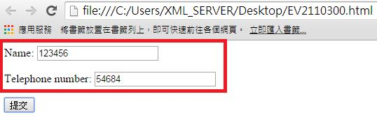
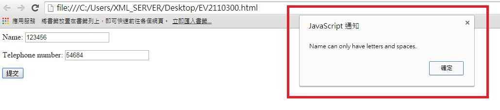
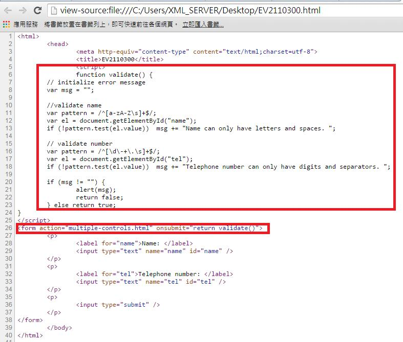

# GN2330301E 使用者輸入的內容不在允許清單中，或格式未符合所需時，均提供文字描述，並提供建議的文字校正

- **稽核評量碼**：GN2330301E
- **對應成功準則**：3.3.3
- **對應認證等級**：AA
- **對應國際技術碼**：G84
- **類別**：General
- **訊息**：使用者輸入的內容不在允許清單中，或格式未符合所需時，均提供文字描述，並提供建議的文字校正
- **英文訊息**：G84: Providing a text description when the user provides information that is not in the list of allowed values / G85: Providing a text description when user input falls outside the required format or values / G177: Providing suggested correction text / ARIA2: Identifying a required field with the aria-required property

## 規則說明
任何在HTML或XHTML的網頁內，出現需要使用者填寫資料的表單，需在表單填完後跳出格式未符合機制，否則表單已完成填寫。 使用aria-required屬性標識必填字段。

## 檢測說明
範例1：輸入錯誤時，提供文字描述

欄位輸入訊息。 按下提交鍵後，會跳出錯誤訊息：輸入格式錯誤。 使用Google Chrome「檢視原始碼」顯示連結(按下右鍵→檢視原始碼)，檢查是否出錯的機制。

## 說明
無

## 範例

**圖片說明：** 瀏覽器開啟「EV2110300.html」範例頁面，以紅框標示含兩個欄位的表單：「Name:」欄位填入「123456」（數字格式不符要求）、「Telephone number:」欄位填入「54684」，下方有「提交」按鈕。示範使用者故意在 Name 欄位填入不在允許格式（僅允許字母與空格）的數字，以測試系統的格式驗證機制。

**圖片說明：** 使用者點擊「提交」按鈕後，頁面右側以紅框標示彈出的「JavaScript 通知」對話框，顯示錯誤訊息：「Name can only have letters and spaces.」，並提供「確定」按鈕關閉通知。表單欄位中 Name 仍顯示「123456」、Telephone number 仍顯示「54684」（資料保留）。示範當輸入內容不符格式時，以文字描述明確說明允許的格式，並提供建議的文字說明協助使用者修正。

**圖片說明：** 「EV2110300.html」的 HTML 原始碼，第5至24行以紅框標示 JavaScript `validate()` 函式：使用正規表示式驗證 Name 欄位（只允許 `[a-zA-Z\s]+`），若不符則 msg 加入「Name can only have letters and spaces.」；驗證 Telephone number 欄位（只允許 `[\d\-+\.\s]+`），若不符則 msg 加入「Telephone number can only have digits and separators.」；最後若 msg 不為空則 `alert(msg)` 彈出錯誤通知。第26行以紅框標示 `<form>` 標籤使用 `onsubmit="return validate()"` 觸發驗證函式。示範使用用戶端 JavaScript 驗證輸入格式並提供文字說明的實作方式。
