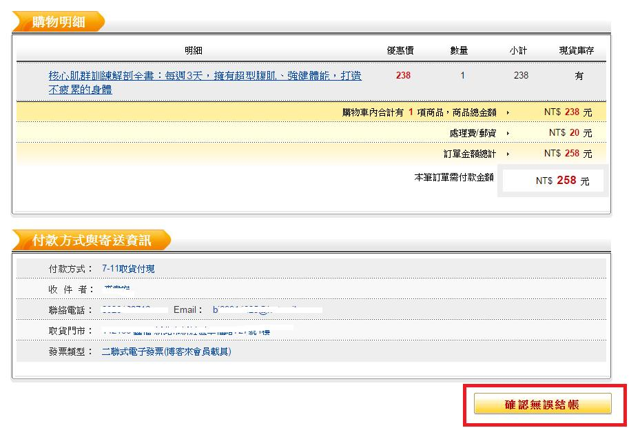

# GN2330403E 在法律、財務、個人資料方面，均要求確認後才繼續所選的行動

- **稽核評量碼**：GN2330403E
- **對應成功準則**：3.3.4
- **對應認證等級**：AA
- **對應國際技術碼**：G155
- **類別**：General
- **訊息**：在法律、財務、個人資料方面，均要求確認後才繼續所選的動作
- **英文訊息**：G155: Providing a checkbox in addition to a submit button / G168: Requesting confirmation to continue with selected action

## 規則說明
網站是否有要求確認後才能繼續所選的功能。

## 檢測說明
網頁中具有"確認無誤結帳"的功能。

## 說明
無

## 範例

**圖片說明：** 購物網站訂單確認頁面截圖，分為「購物明細」與「付款方式與寄送資訊」兩個區塊。購物明細顯示「核心肌群訓練解剖全書」，優惠價 238 元，數量 1，商品總金額 NT$238，處理費/郵資 NT$20，本筆訂單需付款金額 NT$258。付款方式與寄送資訊區塊顯示付款方式（7-11取貨付現）、收件者、聯絡電話、Email、取貨門市、發票類型等資訊。頁面右下角以紅框標示「確認無誤結帳」橘色按鈕，使用者必須明確點擊此確認按鈕後才能完成結帳。示範在法律財務交易中，提供確認頁面並要求使用者主動確認後才繼續完成選定的行動，防止誤操作。
