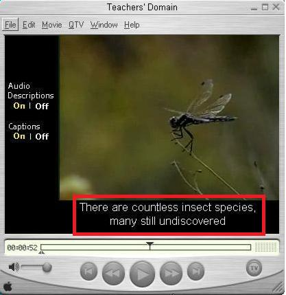
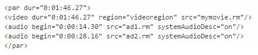

# GN3120700E 當前景音訊停頓處不足插入音訊描述時，為影片提供延伸音訊描述

- **稽核評量碼**：GN3120700E
- **對應成功準則**：1.2.7
- **對應認證等級**：AAA
- **對應國際技術碼**：G8、H96
- **類別**：General
- **訊息**：當前景音訊停頓處不足插入音訊描述時，為影片提供延伸音訊描述
- **英文訊息**：G8: Providing a movie with extended audio descriptions / H96: Using the track element to provide audio descriptions

## 規則說明

使用HTML或XHTML時序媒體及同步媒體網頁中的影片都必要採取此指引

## 檢測說明

使用QuickTime播放器開啟具有額外音訊的描述電影

檢測音訊描述的原始碼

## 說明

無

## 範例

**圖片說明：** 展示QuickTime播放器播放含有音訊描述的視訊。左側面板顯示控制選項，包含「Audio Descriptions」和「Captions」的開關，狀態都設為「On｜Off」。主播放區域顯示一隻蜻蜓停棲在植物上的視訊內容。下方播放器控制欄顯示時間軸（00:08:52）和播放控制按鈕，包含播放、暫停、跳轉等常見控制。特別地，下方有紅色方框標註，顯示音訊描述的文字「There are countless insect species, many still undiscovered」，說明在視訊播放時同時提供的延伸音訊描述內容。此圖展示延伸音訊描述的正確實現方式。

**圖片說明：** 展示支持延伸音訊描述的HTML/XML代碼結構。代碼顯示：(1)<par>標籤定義時間段，從0:01:46.27開始；(2)<video>標籤指定視訊資源「mymovie.rm」及其時間區域；(3)<audio>標籤分別指定：第一個音訊軌「ad1.rm」起始於0:00:14.38（主要音訊），及第二個音訊軌「ad2.rm」起始於0:00:28.16（音訊描述軌），均標記為systemAudioDesc="on"。此代碼結構允許播放器同時管理視訊和多個音訊軌道，提供延伸音訊描述功能。
