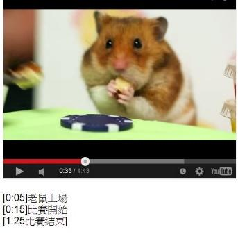

# GN3120801E 提供所有純視訊內容的時序媒體替代內容

- **稽核評量碼**：GN3120801E
- **對應成功準則**：1.2.8
- **對應認證等級**：AAA
- **對應國際技術碼**：G159
- **類別**：General
- **訊息**：提供所有純視訊內容的時序媒體替代內容
- **英文訊息**：G159: Providing an alternative for time-based media for video-only content

## 規則說明

所有網頁中提供的純視訊內容都必須遵守此規則。

## 檢測說明

檢查網頁中是否存在純視訊內容的元件。

並確認是否存在影片的替代內容。

確認影片和替代內容是否相符合。

## 說明

無

## 範例

**圖片說明：** 展示一個純視訊內容的視頻播放頁面，主要內容是一隻倉鼠（小鼠類動物）坐在綠色表面上，面前放有黑色控制器。視訊播放器位於下方，顯示進度條（當前位置0:35/1:43）和播放控制按鈕。重要的是，視訊下方提供文字描述和時間戳記，包含：「[0:05]老鼠上場」、「[0:15]上舞臺」、「[1:25]比賽結束」等內容，這些文字形式的替代內容詳細敘述了純視訊內容中發生的所有事件，使無法觀看視訊的使用者也能理解內容。
