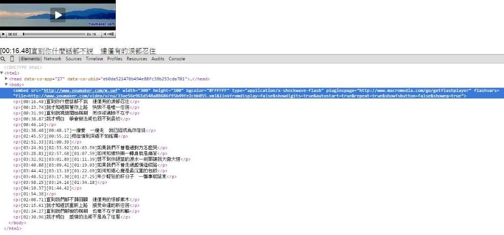

# GN3120900E 提供現場純音訊內容的文字形式替代內容，或在網頁內合併採用現場音訊字幕服務

- **稽核評量碼**：GN3120900E
- **對應成功準則**：1.2.9
- **對應認證等級**：AAA
- **對應國際技術碼**：G150、G157
- **類別**：General
- **訊息**：提供現場純音訊內容的文字形式替代內容，或在網頁內合併採用現場音訊字幕服務。
- **英文訊息**：G150: Providing text based alternatives for live audio-only content / G157: Incorporating a live audio captioning service into a Web page

## 規則說明

使用HTML或XHTML時序媒體及同步媒體網頁中的影片都必要採取此指引。

## 檢測說明

使用Google Chrome「檢視原始碼」顯示連結 (按下右鍵→檢視原始碼)。

檢查是否提供純音訊檔文字形式的替代內容或現場音訊字幕服務。

並在網頁中檢視文字字幕內容是否與音訊檔吻合。

## 說明

無

## 範例

**圖片說明：** 展示YouTube視訊播放頁面及其原始碼檢視。上方顯示一個帶有播放控制的視訊播放器（顯示「YoutubeChat.com」標誌），下方是整個HTML原始碼。關鍵代碼部分用紅色方框標示，包含一個embed元素：「<embed src=\"http://www.youtuber.com/v/swf\" width=\"280\" height=\"190\" wmode=\"#FFFFFF\" type=\"application/x-shockwave-flash\" pluginspage=\"http://www.macromedia.com/go/getflashplayer\" flashvars=\"...autoplay=true&...\"></embed>」。下方還有多行包含時間戳記和中文內容的
標籤（如「[00:16:48]直到你們看錄音不轉」等），這些代表為現場純音訊內容提供的文字形式替代內容或字幕軌道。此圖展示在HTML代碼中正確實現音訊內容文字替代的方式。
