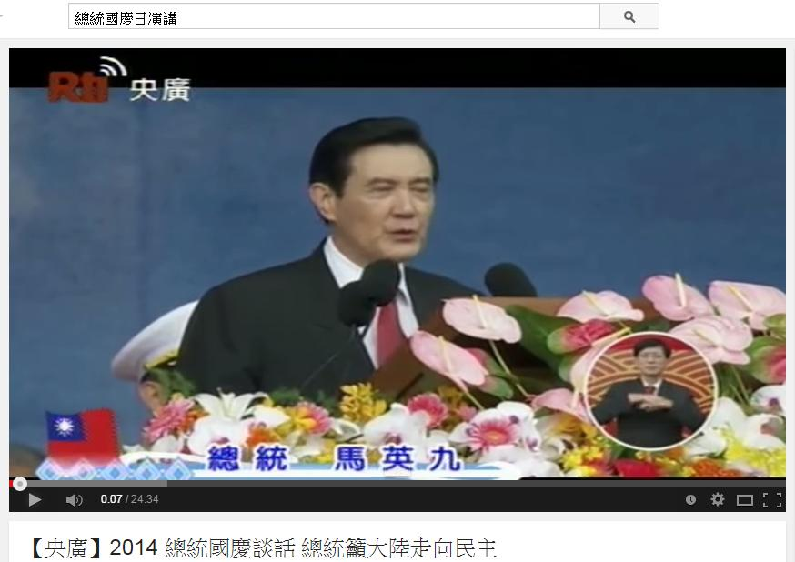

# GN3120901E 提供連往預先準備好的發言文字逐字稿的鏈結；如果有劇本的話，則提供連往劇本的鏈結

- **稽核評量碼**：GN3120901E
- **對應成功準則**：1.2.9
- **對應認證等級**：AAA
- **對應國際技術碼**：G151
- **類別**：General
- **訊息**：提供連往預先準備好的發言文字逐字稿的鏈結；如果有劇本的話，則提供連往劇本的鏈結
- **英文訊息**：G151: Providing a link to a text transcript of a prepared statement or script if the script is followed

## 規則說明

當演講開始時，演講內容也會公布在網路上。

## 檢測說明

網路影片總統正在演講

演講內容同時被公布在網路上，並且有頁數連往下一頁講稿

## 說明

無

## 範例

**圖片說明：** 展示台灣公視新聞網頁面，顯示「總統國慶談話」視訊。畫面中央顯示一位身著黑色正式服裝的男性在舞台上發言，舞台前方裝飾有台灣國旗和粉紅色、黃色花卉。視訊播放器下方顯示「【央廣】2014 總統國慶談話 總統馬大陸走向民主」的標題。頁面上方有搜尋框，顯示「總統國慶口演講」，表示該頁面用於發布和存檔演講內容。此圖展示現場演講內容的網頁呈現方式，應同時提供文字逐字稿或劇本。

**圖片說明：** 展示演講文字逐字稿頁面。頁面包含演講人信息和演講內容全文。上方顯示視訊靜止畫面和演講人圖片（約佔上面區域），下方為大量中文文字內容，記錄了完整的演講詞。文字內容敘述了演講主題、政策議題（如馬匹望鄉、克克爾復德等），以及多段細緻的政治和社會評論。最下方顯示頁碼導航（1、2、3、4、5、6、7、>），允許使用者瀏覽多個頁面的完整演講文字。此圖展示提供預先準備好的發言文字逐字稿的正確實現方式，確保所有使用者，包括無法觀看或聽取視訊的人士，都能獲得演講的完整內容。
