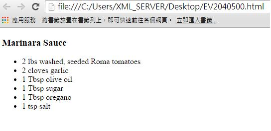

# GN3140700E 混音處理音訊檔案，使非語音的聲音至少比語音音訊內容低20分貝

- **稽核評量碼**：GN3140700E
- **對應成功準則**：1.4.7
- **對應認證等級**：A
- **對應國際技術碼**：G56
- **類別**：General
- **訊息**：混音處理音訊檔案，使非語音的聲音至少比語音音訊內容低20分貝。
- **英文訊息**：G56: Mixing audio files so that non-speech sounds are at least 20 decibels lower than the speech audio content

## 規則說明

敘述者和背景音樂之間有足夠的音頻對比

## 檢測說明

找到的前景講話的背景內容音量值。

測量db(A)SPL音量。

以dB(A)SPL音量測量前景的講話。

減去的值。

檢查的結果是20分貝或更大。

## 說明

無
## 範例

**圖片說明：** 介面元素或設計示例的中等規模截圖。