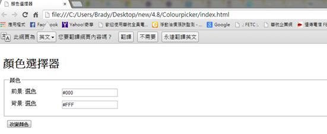
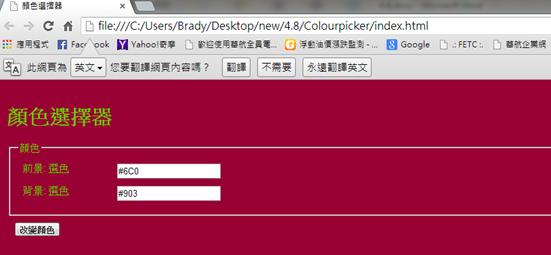
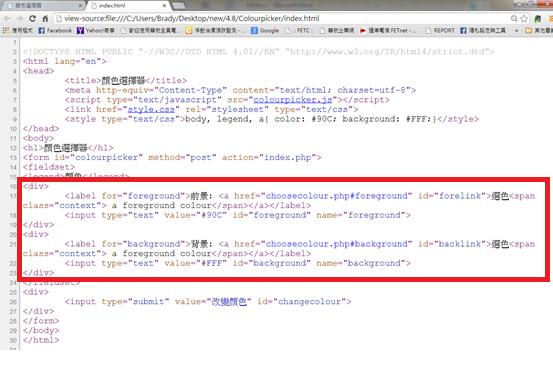

# GN3140800E 使用能夠變更文字區塊前景與背景且容易取得的使用者代理的科技，或者在頁面上提供前景色彩與背景色彩的多重色彩選取工具

- **稽核評量碼**：GN3140800E
- **對應成功準則**：1.4.8
- **對應認證等級**：AAA
- **對應國際技術碼**：G156、G175
- **類別**：General
- **訊息**：使用能夠變更文字區塊前景與背景且容易取得的使用者代理的科技，或者在頁面上提供前景色彩與背景色彩的多重色彩選取工具
- **英文訊息**：G156: Using a technology that has commonly-available user agents that can change the foreground and background of blocks of text / G175: Providing a multi color selection tool on the page for foreground and background colors

## 規則說明

任何讓使用者儲存個人偏好去產生多重色彩選取工具技術的網頁，都必須要遵守此指引。

## 檢測說明

使用chrome打開檔案。

前景：選色可改變前景顏色，而背景：選色可改變背景顏色，這邊以前景#6C0和背景#903為例。

檢視原始碼。

## 說明

無
## 範例

**圖片說明：** 設計示例，說明如何透過色彩加上文字或其他視覺線索來傳達訊息，確保色覺辨識障礙者也能理解。

**圖片說明：** 設計示例，說明如何透過色彩加上文字或其他視覺線索來傳達訊息，確保色覺辨識障礙者也能理解。

**圖片說明：** 表單介面示例，展示必填欄位同時以顏色標示和文字標籤『必填』或『required』標記，滿足色彩無關的無障礙需求。