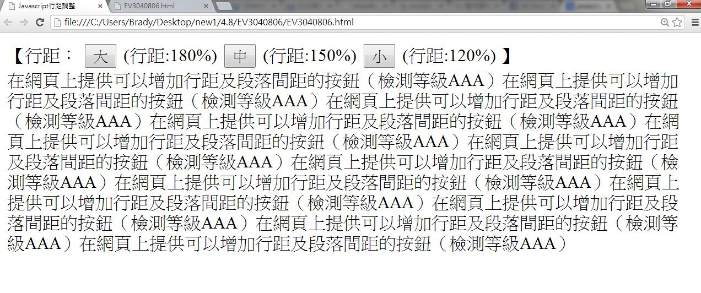
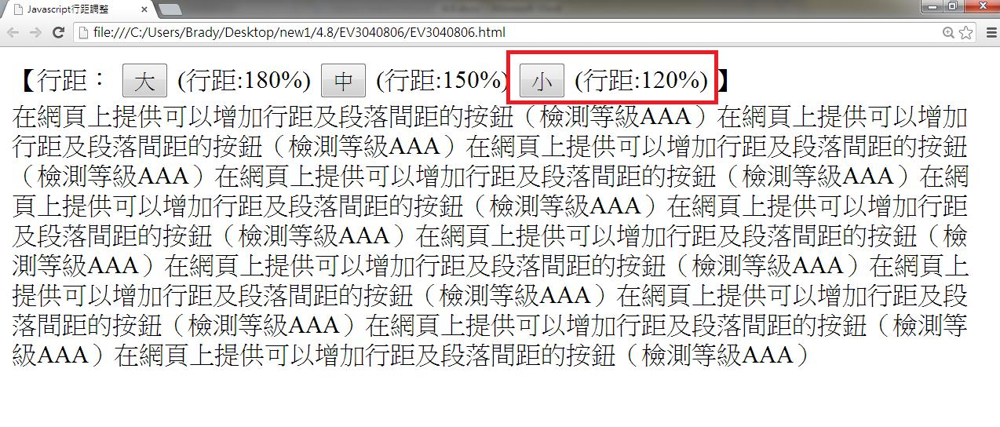
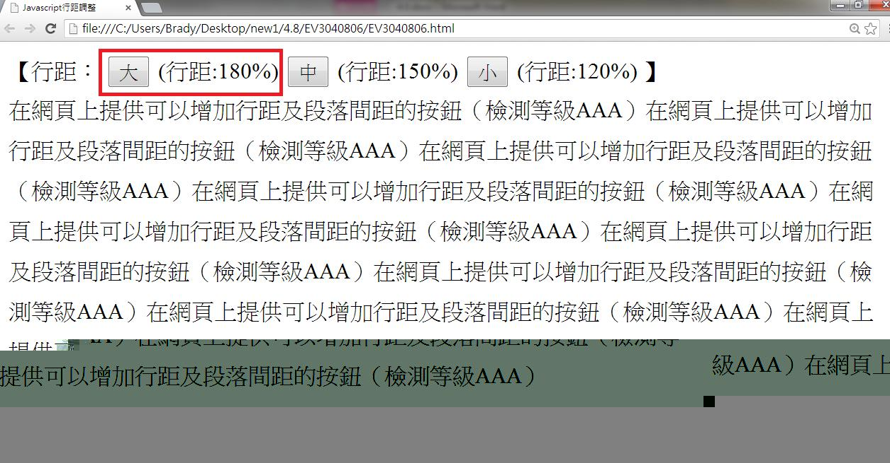
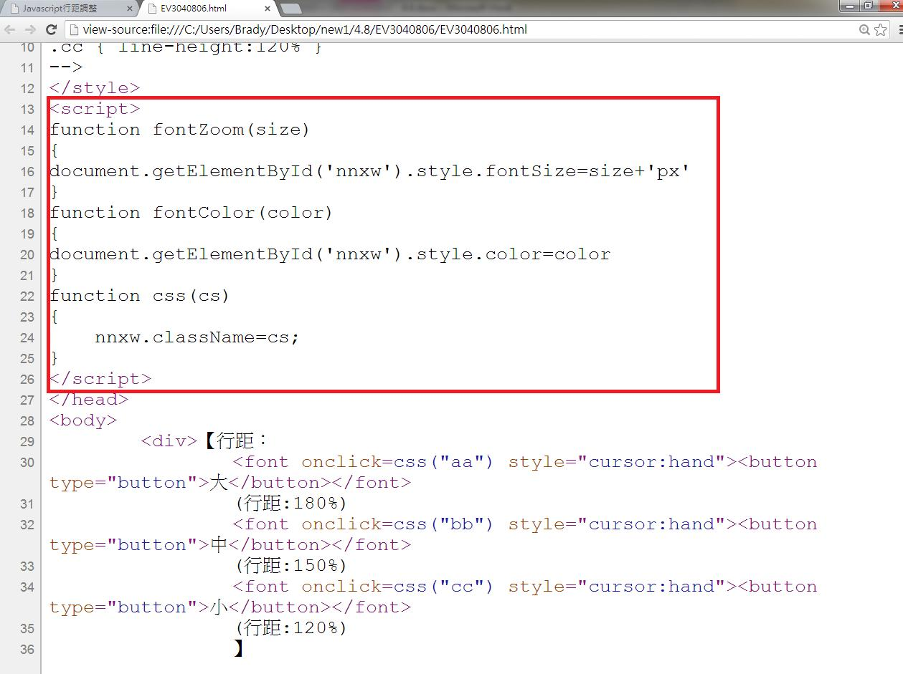

# GN3140805E 在網頁上提供可以增加行距及段落間距的按鈕

- **稽核評量碼**：GN3140805E
- **對應成功準則**：1.4.8
- **對應認證等級**：AAA
- **對應國際技術碼**：G188
- **類別**：General
- **訊息**：在網頁上提供可以增加行距及段落間距的按鈕。
- **英文訊息**：G188: Providing a button on the page to increase line spaces and paragraph spaces

## 規則說明

任何技術關於提供行距及段落間距的網頁，皆須遵從此指引。

## 檢測說明

用chrome打開檔案，此為初始的行距。

點選行距可改變大小，以點選小為例，為原本行距的120%。

點選行距可改變大小，以點選大為例，為原本行距的180%。

檢視原始碼，此為調整行距所用javascript的程式碼。

## 說明

無
## 範例

**圖片說明：** 完整的網頁應用介面截圖，展示無障礙實踐的實現效果。

**圖片說明：** 文字或標籤的簡潔示例截圖。

**圖片說明：** 完整的網頁應用介面截圖，展示無障礙實踐的實現效果。

**圖片說明：** 網頁原始碼的瀏覽器檢視截圖，展示HTML標記和CSS樣式定義。