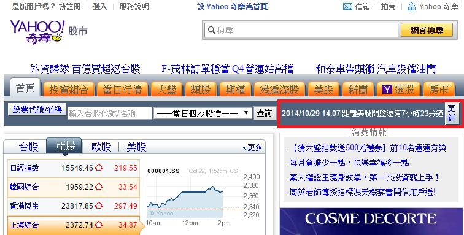

# GN3220400E 提供可以延遲任何內容更新的機制

- **稽核評量碼**：GN3220400E
- **對應成功準則**：2.2.4
- **對應認證等級**：AAA
- **對應國際技術碼**：G75
- **類別**：General
- **訊息**：提供可以延遲任何內容更新的機制。
- **英文訊息**：G75: Providing a mechanism to postpone any updating of content / SCR16: Providing a script that warns the user a time limit is about to expire / SCR36: Providing a mechanism to allow users to display moving, scrolling, or auto-updating text in a static window or area

## 規則說明

提供給使用者自行調整系統刷新的頻率需求(例如，股票頁面)。

## 檢測說明

1. 開啟網頁，審查內容是否為可以更新資訊。
2. 如果是依照以下範例提供更新機制。
3. 如圖提供更新機制。

## 說明

無

## 範例

**圖片說明：** Yahoo 奇摩股市頁面截圖，右上角以紅框標示股市資訊更新機制區塊，顯示「2014/10/29 14:07 距離美股開盤還有7小時23分鐘」以及「更新」按鈕。此設計讓使用者可以手動點擊「更新」按鈕來決定何時刷新股市資訊，而非系統自動強制更新，示範提供延遲內容更新機制的無障礙設計。頁面主體顯示台股、亞股、歐股、美股等各國股市指數資訊及走勢圖。
