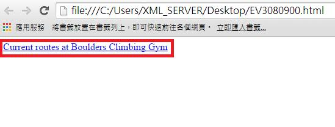
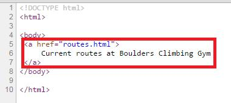

# GN3240900E 針對單獨存在的鏈結，提供描述鏈結目的的鏈結文字

- **稽核評量碼**：GN3240900E
- **對應成功準則**：2.4.9
- **對應認證等級**：AAA
- **對應國際技術碼**：G91
- **類別**：General
- **訊息**：針對單獨存在的鏈結，提供描述鏈結目的的鏈結文字。
- **英文訊息**：G91: Providing link text that describes the purpose of a link SCR30: Using scripts to change the link text ARIA8: Using aria-label for link purpose

## 規則說明
描述鏈結目的之本文，需要遵守此規則。 使用aria-label屬性指出鏈結目的。

## 檢測說明
範例1：提供描述鏈結目的的鏈結文字 針對單獨鏈結部分，具有描述鏈結目的的文字。 可點選右鍵檢視網頁原始碼。

範例2：使用aria-label提供描述鏈結目的的鏈結說明

原始碼：
```html
<h4>Neighborhood News</h4>
<p>Seminole tax hike: Seminole city managers are proposing a 75% increase in property taxes for the coming fiscal year.
<a href="taxhike.html" aria-label="Read more about Seminole tax hike">[Read more...]</a>
</p>
<p>Baby Mayor: Seminole voters elect the city's youngest mayor ever by voting in 3 year old Willy "Dusty" Williams in yesterday's mayoral election.
<a href="babymayor.html" aria-label="Read more about Seminole's new baby mayor">[Read more...]</a>
</p>
```

## 說明
無

## 範例



**圖片說明：** 瀏覽器開啟「EV3080900.html」範例頁面，頁面顯示以紅框標示的鏈結「Current routes at Boulders Climbing Gym」，鏈結文字完整描述鏈結目的（前往 Boulders 攀岩館的目前路線頁面），無需依賴前後文脈絡即可理解鏈結用途。示範針對單獨存在的鏈結，提供清楚描述鏈結目的的鏈結文字。



**圖片說明：** 「EV3080900.html」的 HTML 原始碼，第5至7行以紅框標示：`<a href="routes.html">Current routes at Boulders Climbing Gym</a>`。示範使用清楚描述性的鏈結文字「Current routes at Boulders Climbing Gym」作為 `<a>` 元素的內容，讓使用者（包括螢幕報讀器使用者）在不需要前後文脈絡的情況下，即可從鏈結文字本身了解鏈結的目的地與用途。
