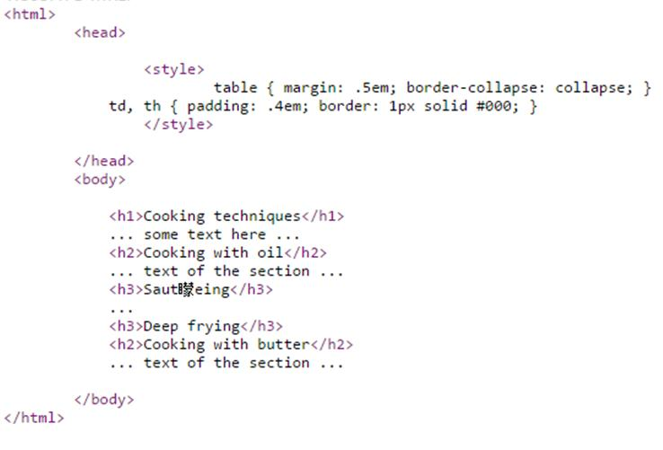

# GN3241000E 使用標頭來組織網頁

- **稽核評量碼**：GN3241000E
- **對應成功準則**：2.4.10
- **對應認證等級**：AAA
- **對應國際技術碼**：G141
- **類別**：General
- **訊息**：使用標頭來組織網頁
- **英文訊息**：G141: Organizing a page using headings

## 規則說明
所有網頁內容標題需有標頭標籤`<h1>`~`<h6>`，皆須遵守。 當頁面中有H1~H6標籤即通過軟體檢測，但仍須由人工確認內容是否為文字內容。

## 檢測說明
開啟網頁。 檢視原始碼。 標題需有標頭標籤，例如框框中的`<h1>Cooking…</h1>`、`<h2>….</h2>` …..

## 說明
無

## 範例

**圖片說明：** 範例頁面顯示使用標頭組織的烹飪技巧內容：一級標題「Cooking techniques」（最大字體）、二級標題「Cooking with oil」與「Cooking with butter」（次大字體）、三級標題「Sautéeing」與「Deep frying」（第三層級字體）。各標題層次清晰，視覺上以字體大小區分層級，示範使用 H1~H3 標頭元素依層次組織頁面內容結構。

**圖片說明：** 範例頁面的 HTML 原始碼，顯示標頭標籤的使用：`<h1>Cooking techniques</h1>`（一級標題）、`<h2>Cooking with oil</h2>`（二級標題）、`<h3>Sautéeing</h3>` 與 `<h3>Deep frying</h3>`（三級標題）、`<h2>Cooking with butter</h2>`（二級標題）。示範使用 `<h1>` 至 `<h3>` 標頭標籤依內容層次組織網頁，使螢幕報讀器使用者能透過標頭導覽快速了解頁面結構並跳轉至所需章節。
