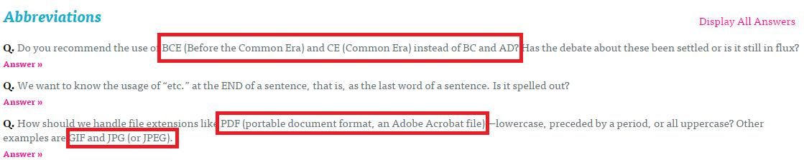

# GN3310300E 針對不常見的字詞，列舉詞彙、提供定義，或提供搜尋線上辭典的功能

- **稽核評量碼**：GN3310300E
- **對應成功準則**：3.1.3
- **對應認證等級**：AAA
- **對應國際技術碼**：G55
- **類別**：General
- **訊息**：針對不常見的字詞，列舉詞彙、提供定義，或提供搜尋線上辭典的功能。
- **英文訊息**：G55: Linking to definitions / G62: Providing a glossary / G70: Providing a function to search an online dictionary / G101: Providing the definition of a word or phrase used in an unusual or restricted way / G112: Using inline definitions / H40: Using definition lists / H54: Using the dfn element to identify the defining instance of a word / H60: Using the link element to link to a glossary

## 規則說明
所有網頁若具有不常見的字詞都必須遵守此指引。

## 檢測說明
檢查頁面文字的可讀性。 若網頁上列舉詞彙、提供定義或提供搜尋線上辭典，則進一步檢查功能是否正常。

## 說明
無

## 範例

**圖片說明：** 英文問答網站「Abbreviations」頁面截圖，以紅框標示三處不常見縮寫及其定義：第一處標示「BCE (Before the Common Era) and CE (Common Era) instead of BC and AD?」，第二處標示「PDF (portable document format, an Adobe Acrobat file)」，第三處標示「GIF and JPG (or JPEG).」。各問題下方有「Answer »」鏈結，示範在文字中直接提供縮寫詞的定義，讓讀者能理解不常見或專業術語的含義。

**圖片說明：** 同一「Abbreviations」問答頁面，展開回答後的截圖，以紅框標示三個已展開的答案區塊（Answer），每個問題下方均顯示詳細解釋：第一個回答說明 BCE/CE 與 BC/AD 的使用慣例；第二個回答說明「etc.」（et cetera）的用法及 CMOS 的建議；第三個回答說明 PDF、JPG、GIF 等縮寫的處理方式。各回答下有「« Close」收合鏈結。示範針對不常見縮寫詞提供完整定義說明，協助使用者理解專業或特殊用語的意涵。
