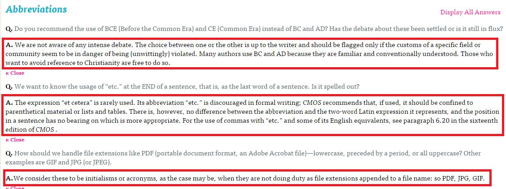

# GN3310400E 針對縮寫字，列舉詞彙、提供其展開的形式或定義，或提供搜尋線上辭典的功能

- **稽核評量碼**：GN3310400E
- **對應成功準則**：3.1.4
- **對應認證等級**：AAA
- **對應國際技術碼**：G55
- **類別**：General
- **訊息**：針對縮寫字，列舉詞彙、提供其展開的形式或定義，或提供搜尋線上辭典的功能
- **英文訊息**：G55: Linking to definitions / G62: Providing a glossary / G70: Providing a function to search an online dictionary / G97: Providing the first use of an abbreviation immediately before or after the expanded form / G102: Providing the expansion or explanation of an abbreviation / H28: Providing definitions for abbreviations by using the abbr and acronym elements / H60: Using the link element to link to a glossary

## 規則說明
所有網頁若具有縮寫字都必須遵守此指引。

## 檢測說明
檢查頁面文字的縮寫。 若網頁上列舉詞彙、提供定義或提供搜尋線上辭典，則進一步檢查功能是否正常。

## 說明
無

## 範例

**圖片說明：** 英文問答網站「Abbreviations」頁面截圖，以紅框標示三處縮寫及其展開形式：第一處標示「BCE (Before the Common Era) and CE (Common Era) instead of BC and AD?」，第二處標示「PDF (portable document format, an Adobe Acrobat file)」，第三處標示「GIF and JPG (or JPEG).」。各縮寫在文字中緊接附上完整展開形式，示範在縮寫字首次出現時立即提供其完整形式或定義，讓讀者能理解縮寫的含義。

**圖片說明：** 同一「Abbreviations」問答頁面展開回答的截圖，以紅框標示三個答案區塊：第一個回答說明 BCE/CE 縮寫的使用建議；第二個回答說明 etc.（et cetera）縮寫的用法，並引用 CMOS 規範；第三個回答說明 PDF、JPG、GIF 等縮寫在非副檔名情境下的處理方式。各回答下有「« Close」收合鏈結。示範針對縮寫字提供展開形式和完整定義，協助使用者了解各縮寫的實際意涵。
