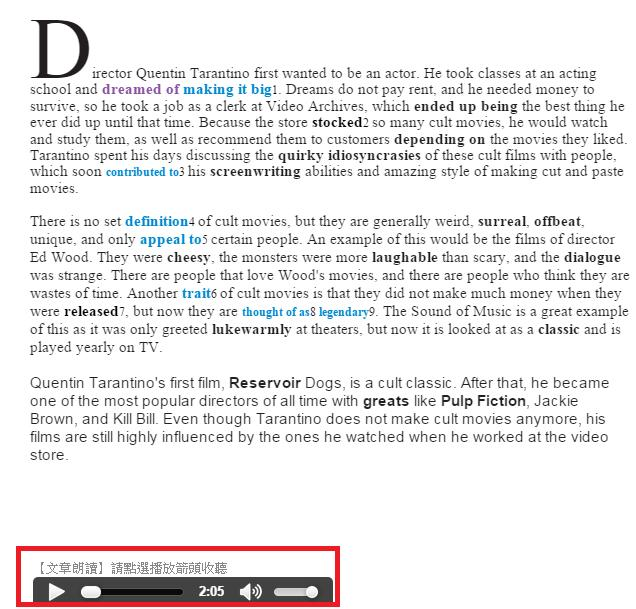

# GN3310500E 提供文字的口說版本

- **稽核評量碼**：GN3310500E
- **對應成功準則**：3.1.5
- **對應認證等級**：AAA
- **對應國際技術碼**：G79
- **類別**：General
- **訊息**：提供文字的口說版本。
- **英文訊息**：G79: Providing a spoken version of the text

## 規則說明
網頁中具有音頻格式(例如.MP3、.WAV、.AU等)。

## 檢測說明
網頁中具有朗讀文章的口說版本。

## 說明
無

## 範例

**圖片說明：** 網頁文章截圖，內容為英文文章介紹導演 Quentin Tarantino，文中多處詞彙以粗體或顏色標示（如 dreamed of making it big、ended up being、stocked、quirky idiosyncrasies、screenwriting、surreal、laughable 等），並附有上標數字（1–9）表示詞彙說明連結。頁面底部以紅框標示「【文章朗讀】請點選播放鈕收聽」提示，以及一個音訊播放器（顯示時長 2:05、播放/暫停按鈕、音量控制）。示範在網頁文字旁提供口說（朗讀）音訊版本，讓閱讀有困難的使用者可以收聽文章的語音播放。
