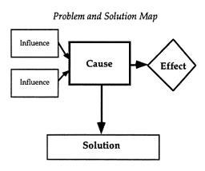
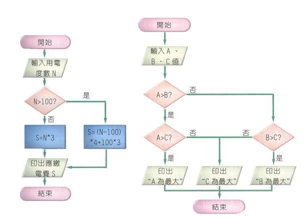

# GN3310502E 提供視覺插圖、圖片、符號以協助解釋概念、事件、程序

- **稽核評量碼**：GN3310502E
- **對應成功準則**：3.1.5
- **對應認證等級**：AAA
- **對應國際技術碼**：G103
- **類別**：General
- **訊息**：提供視覺插圖、圖片、符號以協助解釋概念、事件、程序。
- **英文訊息**：G103: Providing visual illustrations, pictures, and symbols to help explain ideas, events, and processes

## 規則說明
網頁中具有流程圖、視頻和動畫協助使用者理解事件的過程。

## 檢測說明
網頁中具有流程圖幫助使用者理解事件的過程。

## 說明
無

## 範例

**圖片說明：** 「Problem and Solution Map」（問題與解決方案地圖）流程圖，以方框與箭頭呈現：左側兩個「Influence」方框以箭頭指向中央的「Cause」（原因）方框，「Cause」右側以箭頭連接菱形「Effect」（效果）框，「Cause」下方以箭頭連接「Solution」（解決方案）方框。示範使用視覺圖示（流程圖）幫助使用者理解「影響—原因—效果—解決方案」的邏輯關係概念，讓文字說明更易於理解。

**圖片說明：** 兩個程式流程圖並排顯示。左側流程圖說明電費計算程序：從「開始」出發，輸入用電度數 N，判斷 N>100 是否成立，若是則 S=(N-100)*4+100*3，否則 S=N*3，最後印出應繳電費 S 並結束。右側流程圖說明比較三個數值 A、B、C 找出最大值的程序：從「開始」輸入 A、B、C 值，依序比較 A>B、A>C、B>C，分別印出「A 為最大」、「C 為最大」或「B 為最大」後結束。示範使用流程圖視覺插圖協助使用者理解程式邏輯與判斷流程。
