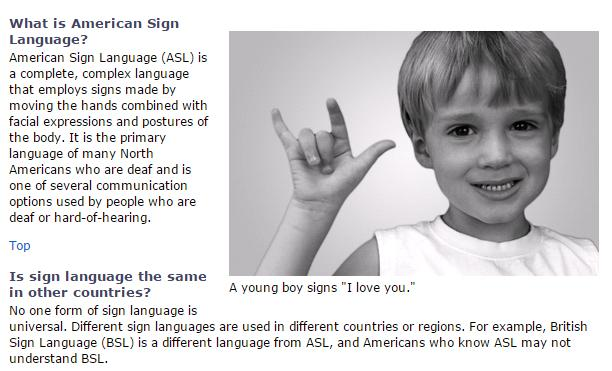
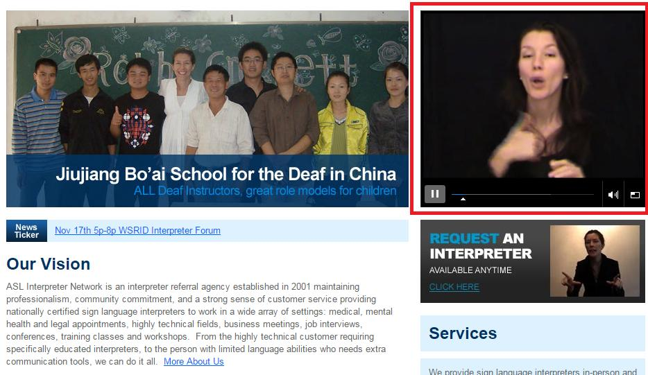

# GN3310504E 針對使用內容所必需理解之資訊、概念、程序，提供手語版本

- **稽核評量碼**：GN3310504E
- **對應成功準則**：3.1.5
- **對應認證等級**：AAA
- **對應國際技術碼**：G160
- **類別**：General
- **訊息**：針對使用內容所必需理解之資訊、概念、程序，提供手語版本。
- **英文訊息**：G160: Providing sign language versions of information, ideas, and processes that must be understood in order to use the content

## 規則說明
網頁中須提供手語視頻來描述必需理解之資訊、概念、程序。

## 檢測說明
網頁中具有手語視頻。

## 說明
無

## 範例

**圖片說明：** 網頁截圖，左側文字說明「What is American Sign Language?」，內容介紹美國手語（ASL）是一種完整且複雜的語言，使用手勢結合臉部表情和身體姿勢，是許多北美失聰者的主要語言；右側為一位男孩比出「I love you」手語的黑白照片，下方有圖說「A young boy signs "I love you."」。下方另有「Is sign language the same in other countries?」段落，說明各國手語不同（如英式手語 BSL 與 ASL 不同）。示範在網頁文字旁提供手語相關視覺內容協助使用者理解。

**圖片說明：** ASL Interpreter Network 網站截圖，左側顯示「Jiujiang Bo'ai School for the Deaf in China」（中國九江博愛聾校）師生合照及「Our Vision」組織介紹文字。右上方以紅框標示一個嵌入式手語視頻播放器，畫面中一位女性手語譯員正在進行手語詮釋，播放器底部有暫停按鈕與音量控制。右下方有「REQUEST AN INTERPRETER AVAILABLE ANYTIME」（隨時可申請口譯員）區塊，另有一位手語譯員的縮圖。示範在網頁中嵌入手語視頻，提供使用者所需理解之資訊的手語版本。
